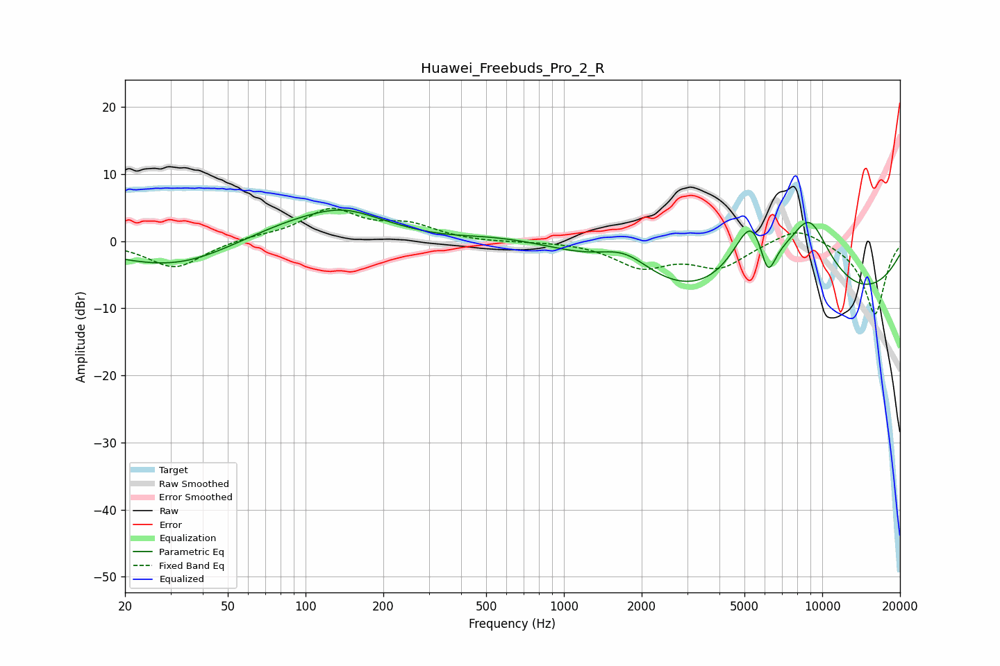

# Huawei_Freebuds_Pro_2_R
See [usage instructions](https://github.com/jaakkopasanen/AutoEq#usage) for more options and info.

### Parametric EQs
Apply preamp of -4.7 dB when using parametric equalizer.

|   # | Type    |   Fc (Hz) |    Q |   Gain (dB) |
|-----|---------|-----------|------|-------------|
|   1 | Peaking |        33 | 0.57 |        -4.8 |
|   2 | Peaking |        92 | 0.89 |         0.7 |
|   3 | Peaking |       140 | 1.18 |         1.8 |
|   4 | Peaking |       240 | 0.19 |         4.7 |
|   5 | Peaking |       318 | 0.66 |        -2.7 |
|   6 | Peaking |      1725 | 1.3  |         3.9 |
|   7 | Peaking |      5352 | 1.62 |        12   |
|   8 | Peaking |      6152 | 4.28 |        -6.1 |
|   9 | Peaking |      6514 | 0.19 |       -13.4 |
|  10 | Peaking |      8909 | 1.19 |        13.4 |

### Fixed Band EQs
When using fixed band (also called graphic) equalizer, apply preamp of **-5.0 dB** (if available) and set gains manually with these parameters.

|   # | Type    |   Fc (Hz) |    Q |   Gain (dB) |
|-----|---------|-----------|------|-------------|
|   1 | Peaking |        31 | 1.41 |        -4.1 |
|   2 | Peaking |        62 | 1.41 |         0.5 |
|   3 | Peaking |       125 | 1.41 |         4.5 |
|   4 | Peaking |       250 | 1.41 |         2.2 |
|   5 | Peaking |       500 | 1.41 |        -0.2 |
|   6 | Peaking |      1000 | 1.41 |         0.1 |
|   7 | Peaking |      2000 | 1.41 |        -3.6 |
|   8 | Peaking |      4000 | 1.41 |        -3.6 |
|   9 | Peaking |      8000 | 1.41 |         2.5 |
|  10 | Peaking |     16000 | 1.41 |       -11   |

### Graphs

