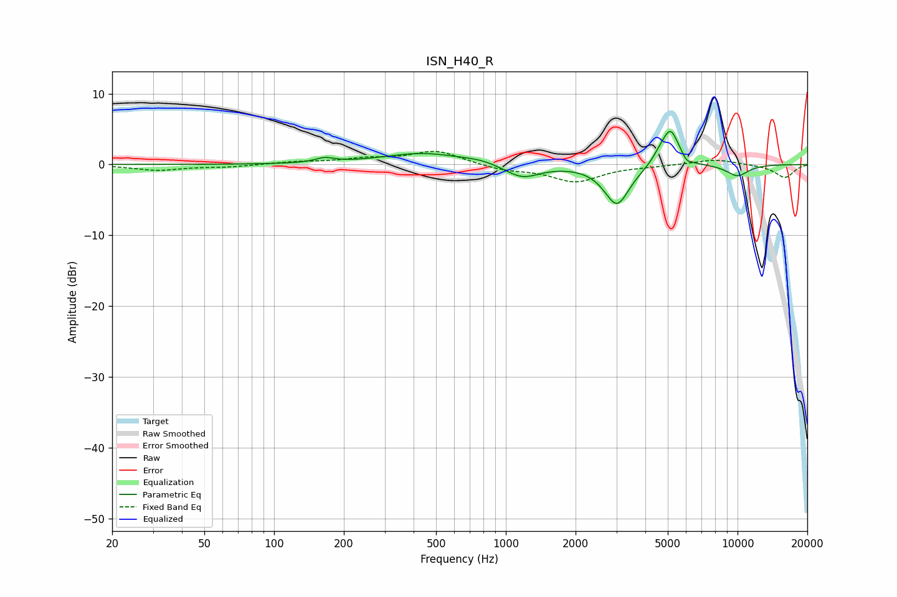

# ISN_H40_R
See [usage instructions](https://github.com/jaakkopasanen/AutoEq#usage) for more options and info.

### Parametric EQs
Apply preamp of -4.8 dB when using parametric equalizer.

|   # | Type    |   Fc (Hz) |    Q |   Gain (dB) |
|-----|---------|-----------|------|-------------|
|   1 | Peaking |       165 | 3.53 |         0.6 |
|   2 | Peaking |       437 | 0.83 |         1.6 |
|   3 | Peaking |       778 | 1.85 |         0.4 |
|   4 | Peaking |      1175 | 1.86 |        -2   |
|   5 | Peaking |      3017 | 2.59 |        -5.7 |
|   6 | Peaking |      4622 | 4.12 |         1.2 |
|   7 | Peaking |      5139 | 4.05 |         4.7 |
|   8 | Peaking |      5753 | 5.98 |         0.7 |
|   9 | Peaking |      5954 | 6    |        -1.1 |
|  10 | Peaking |      9990 | 2.5  |        -1.6 |

### Fixed Band EQs
When using fixed band (also called graphic) equalizer, apply preamp of **-1.9 dB** (if available) and set gains manually with these parameters.

|   # | Type    |   Fc (Hz) |    Q |   Gain (dB) |
|-----|---------|-----------|------|-------------|
|   1 | Peaking |        31 | 1.41 |        -0.8 |
|   2 | Peaking |        62 | 1.41 |        -0.3 |
|   3 | Peaking |       125 | 1.41 |         0.3 |
|   4 | Peaking |       250 | 1.41 |         0.7 |
|   5 | Peaking |       500 | 1.41 |         1.9 |
|   6 | Peaking |      1000 | 1.41 |        -0.7 |
|   7 | Peaking |      2000 | 1.41 |        -2.4 |
|   8 | Peaking |      4000 | 1.41 |        -0.2 |
|   9 | Peaking |      8000 | 1.41 |         0.8 |
|  10 | Peaking |     16000 | 1.41 |        -1.9 |

### Graphs

