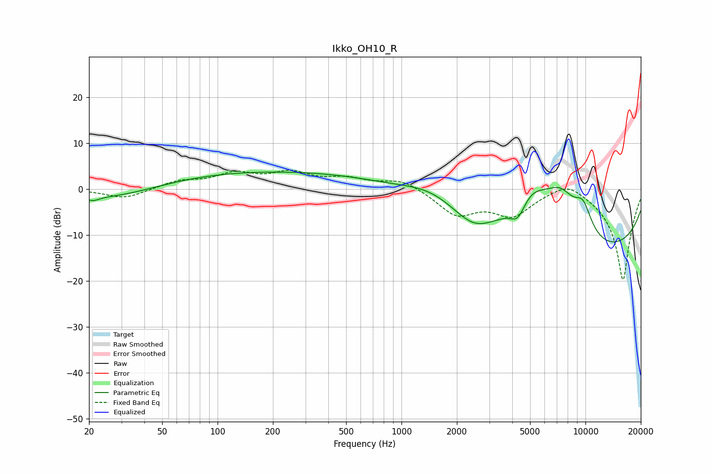

# Ikko_OH10_R
See [usage instructions](https://github.com/jaakkopasanen/AutoEq#usage) for more options and info.

### Parametric EQs
Apply preamp of -3.8 dB when using parametric equalizer.

|   # | Type    |   Fc (Hz) |    Q |   Gain (dB) |
|-----|---------|-----------|------|-------------|
|   1 | Peaking |        21 | 4.17 |        -0.9 |
|   2 | Peaking |        27 | 0.52 |        -2.9 |
|   3 | Peaking |       185 | 0.19 |         4   |
|   4 | Peaking |      1453 | 0.89 |         3.2 |
|   5 | Peaking |      2467 | 1.37 |        -3.3 |
|   6 | Peaking |      4297 | 3.29 |        -4   |
|   7 | Peaking |      5045 | 1.19 |         8.8 |
|   8 | Peaking |      7339 | 1.26 |         9.6 |
|   9 | Peaking |      9407 | 0.19 |       -15.1 |
|  10 | Peaking |      9703 | 2.53 |         5.8 |

### Fixed Band EQs
When using fixed band (also called graphic) equalizer, apply preamp of **-4.2 dB** (if available) and set gains manually with these parameters.

|   # | Type    |   Fc (Hz) |    Q |   Gain (dB) |
|-----|---------|-----------|------|-------------|
|   1 | Peaking |        31 | 1.41 |        -2.1 |
|   2 | Peaking |        62 | 1.41 |         1.6 |
|   3 | Peaking |       125 | 1.41 |         3   |
|   4 | Peaking |       250 | 1.41 |         3.2 |
|   5 | Peaking |       500 | 1.41 |         2   |
|   6 | Peaking |      1000 | 1.41 |         2.2 |
|   7 | Peaking |      2000 | 1.41 |        -5.4 |
|   8 | Peaking |      4000 | 1.41 |        -5.3 |
|   9 | Peaking |      8000 | 1.41 |         2.7 |
|  10 | Peaking |     16000 | 1.41 |       -20   |

### Graphs

