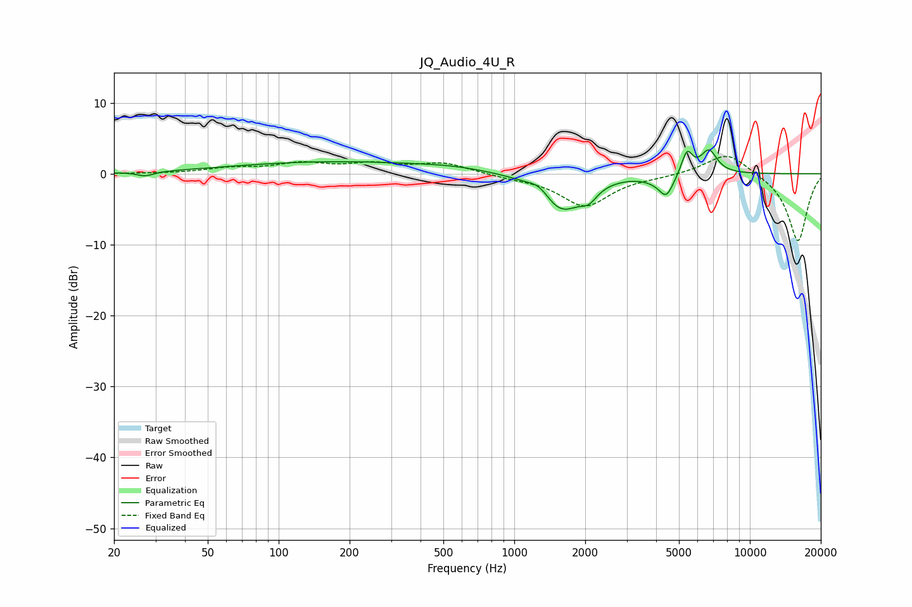

# JQ_Audio_4U_R
See [usage instructions](https://github.com/jaakkopasanen/AutoEq#usage) for more options and info.

### Parametric EQs
Apply preamp of -3.4 dB when using parametric equalizer.

|   # | Type    |   Fc (Hz) |    Q |   Gain (dB) |
|-----|---------|-----------|------|-------------|
|   1 | Peaking |        27 | 3.96 |        -0.6 |
|   2 | Peaking |       173 | 0.32 |         1.7 |
|   3 | Peaking |       555 | 0.95 |         0.4 |
|   4 | Peaking |      1278 | 3.24 |         1.3 |
|   5 | Peaking |      1582 | 1.64 |        -5.3 |
|   6 | Peaking |      2072 | 3.99 |        -1.7 |
|   7 | Peaking |      3895 | 2.82 |        -0.4 |
|   8 | Peaking |      4420 | 4.44 |        -3   |
|   9 | Peaking |      5411 | 5.93 |         3.3 |
|  10 | Peaking |      6697 | 3.87 |         3.3 |

### Fixed Band EQs
When using fixed band (also called graphic) equalizer, apply preamp of **-2.5 dB** (if available) and set gains manually with these parameters.

|   # | Type    |   Fc (Hz) |    Q |   Gain (dB) |
|-----|---------|-----------|------|-------------|
|   1 | Peaking |        31 | 1.41 |        -0   |
|   2 | Peaking |        62 | 1.41 |         0.7 |
|   3 | Peaking |       125 | 1.41 |         1.3 |
|   4 | Peaking |       250 | 1.41 |         1.2 |
|   5 | Peaking |       500 | 1.41 |         1.5 |
|   6 | Peaking |      1000 | 1.41 |        -0.4 |
|   7 | Peaking |      2000 | 1.41 |        -4.5 |
|   8 | Peaking |      4000 | 1.41 |        -0.3 |
|   9 | Peaking |      8000 | 1.41 |         3.2 |
|  10 | Peaking |     16000 | 1.41 |        -9.6 |

### Graphs

