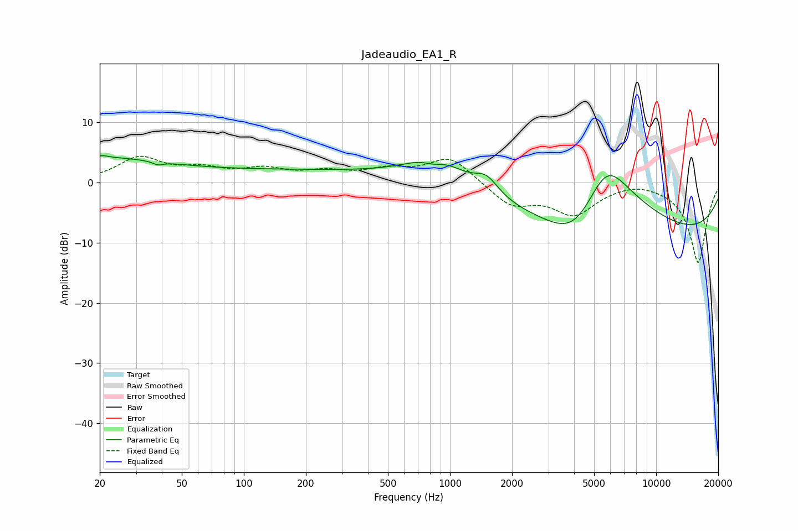

# Jadeaudio_EA1_R
See [usage instructions](https://github.com/jaakkopasanen/AutoEq#usage) for more options and info.

### Parametric EQs
Apply preamp of -4.6 dB when using parametric equalizer.

|   # | Type    |   Fc (Hz) |    Q |   Gain (dB) |
|-----|---------|-----------|------|-------------|
|   1 | Peaking |        20 | 0.44 |         3.8 |
|   2 | Peaking |        21 | 5.07 |         0.4 |
|   3 | Peaking |        38 | 5.98 |        -0.5 |
|   4 | Peaking |       201 | 0.26 |         1.9 |
|   5 | Peaking |       831 | 2.94 |        -1   |
|   6 | Peaking |       871 | 0.95 |         5.4 |
|   7 | Peaking |      1505 | 2.44 |         2.8 |
|   8 | Peaking |      4085 | 0.93 |        -8.5 |
|   9 | Peaking |      5705 | 0.69 |        19.1 |
|  10 | Peaking |      7549 | 0.18 |       -13   |

### Fixed Band EQs
When using fixed band (also called graphic) equalizer, apply preamp of **-4.5 dB** (if available) and set gains manually with these parameters.

|   # | Type    |   Fc (Hz) |    Q |   Gain (dB) |
|-----|---------|-----------|------|-------------|
|   1 | Peaking |        31 | 1.41 |         4   |
|   2 | Peaking |        62 | 1.41 |         1.8 |
|   3 | Peaking |       125 | 1.41 |         1.9 |
|   4 | Peaking |       250 | 1.41 |         1.5 |
|   5 | Peaking |       500 | 1.41 |         1.8 |
|   6 | Peaking |      1000 | 1.41 |         4.3 |
|   7 | Peaking |      2000 | 1.41 |        -3.7 |
|   8 | Peaking |      4000 | 1.41 |        -4.9 |
|   9 | Peaking |      8000 | 1.41 |         0.6 |
|  10 | Peaking |     16000 | 1.41 |       -13.3 |

### Graphs

