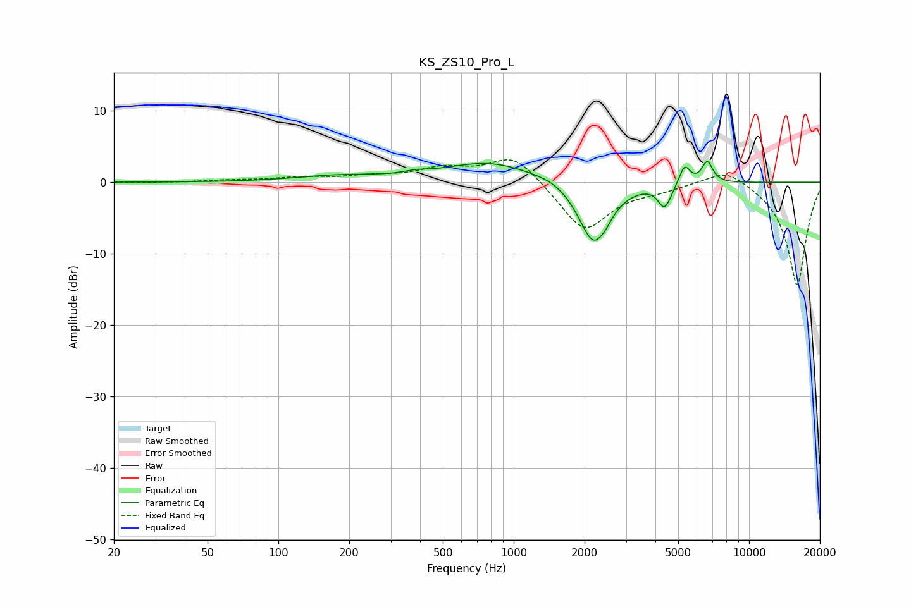

# KS_ZS10_Pro_L
See [usage instructions](https://github.com/jaakkopasanen/AutoEq#usage) for more options and info.

### Parametric EQs
Apply preamp of -3.0 dB when using parametric equalizer.

|   # | Type    |   Fc (Hz) |    Q |   Gain (dB) |
|-----|---------|-----------|------|-------------|
|   1 | Peaking |       178 | 0.79 |         0.8 |
|   2 | Peaking |       382 | 2.99 |         0.4 |
|   3 | Peaking |       789 | 0.74 |         2.8 |
|   4 | Peaking |      1479 | 2.13 |         0.5 |
|   5 | Peaking |      2182 | 2.17 |        -8.6 |
|   6 | Peaking |      2469 | 5.16 |        -0.6 |
|   7 | Peaking |      4344 | 5.36 |        -2.7 |
|   8 | Peaking |      4548 | 6    |        -0.7 |
|   9 | Peaking |      5326 | 6    |         2.7 |
|  10 | Peaking |      6646 | 6    |         3   |

### Fixed Band EQs
When using fixed band (also called graphic) equalizer, apply preamp of **-3.2 dB** (if available) and set gains manually with these parameters.

|   # | Type    |   Fc (Hz) |    Q |   Gain (dB) |
|-----|---------|-----------|------|-------------|
|   1 | Peaking |        31 | 1.41 |        -0   |
|   2 | Peaking |        62 | 1.41 |         0.2 |
|   3 | Peaking |       125 | 1.41 |         0.6 |
|   4 | Peaking |       250 | 1.41 |         0.7 |
|   5 | Peaking |       500 | 1.41 |         1.7 |
|   6 | Peaking |      1000 | 1.41 |         4   |
|   7 | Peaking |      2000 | 1.41 |        -7   |
|   8 | Peaking |      4000 | 1.41 |        -0.8 |
|   9 | Peaking |      8000 | 1.41 |         2.3 |
|  10 | Peaking |     16000 | 1.41 |       -14.5 |

### Graphs

