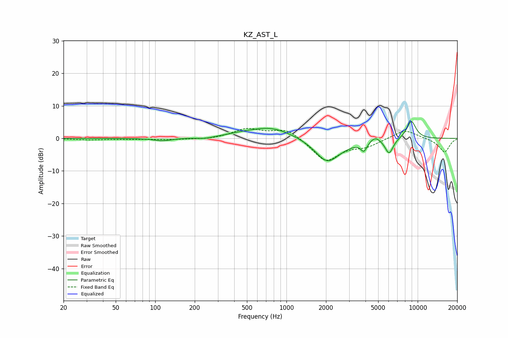

# KZ_AST_L
See [usage instructions](https://github.com/jaakkopasanen/AutoEq#usage) for more options and info.

### Parametric EQs
Apply preamp of -5.3 dB when using parametric equalizer.

|   # | Type    |   Fc (Hz) |    Q |   Gain (dB) |
|-----|---------|-----------|------|-------------|
|   1 | Peaking |       114 | 2.12 |        -0.8 |
|   2 | Peaking |       239 | 2.43 |        -0.5 |
|   3 | Peaking |       431 | 1.66 |         0.4 |
|   4 | Peaking |       751 | 0.82 |         3.5 |
|   5 | Peaking |      2036 | 1.52 |        -6.9 |
|   6 | Peaking |      2537 | 1.17 |        -0.8 |
|   7 | Peaking |      3892 | 6    |        -2.8 |
|   8 | Peaking |      4747 | 3.69 |         1.6 |
|   9 | Peaking |      6057 | 4.39 |        -4.7 |
|  10 | Peaking |      8931 | 3.5  |         5.6 |

### Fixed Band EQs
When using fixed band (also called graphic) equalizer, apply preamp of **-3.2 dB** (if available) and set gains manually with these parameters.

|   # | Type    |   Fc (Hz) |    Q |   Gain (dB) |
|-----|---------|-----------|------|-------------|
|   1 | Peaking |        31 | 1.41 |        -0.4 |
|   2 | Peaking |        62 | 1.41 |        -0.2 |
|   3 | Peaking |       125 | 1.41 |        -0.4 |
|   4 | Peaking |       250 | 1.41 |        -0.4 |
|   5 | Peaking |       500 | 1.41 |         2.8 |
|   6 | Peaking |      1000 | 1.41 |         3.1 |
|   7 | Peaking |      2000 | 1.41 |        -7   |
|   8 | Peaking |      4000 | 1.41 |        -2.1 |
|   9 | Peaking |      8000 | 1.41 |         2.8 |
|  10 | Peaking |     16000 | 1.41 |        -4.3 |

### Graphs

