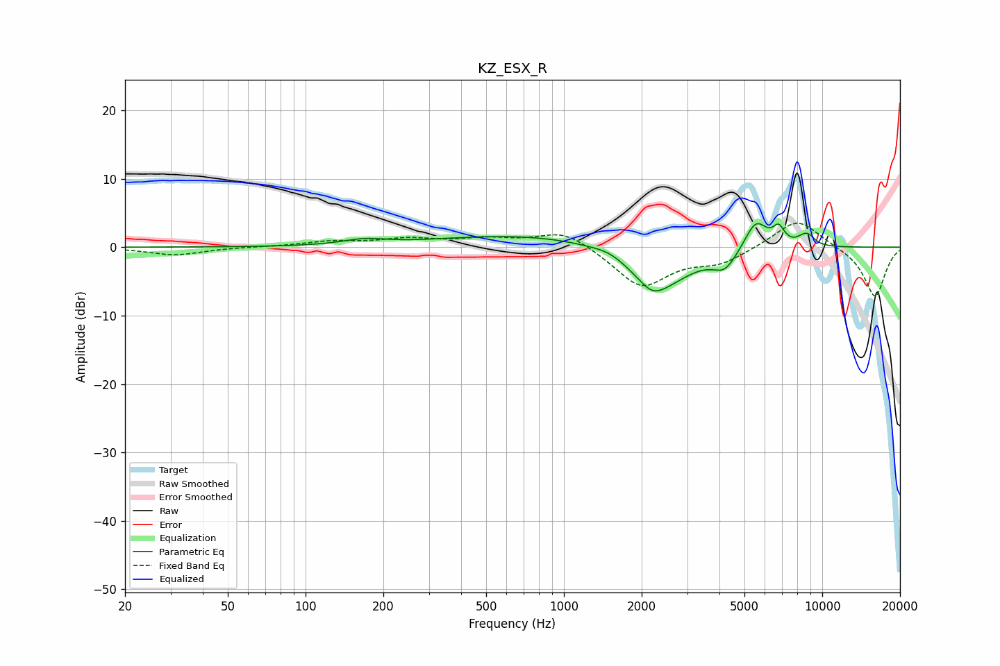

# KZ_ESX_R
See [usage instructions](https://github.com/jaakkopasanen/AutoEq#usage) for more options and info.

### Parametric EQs
Apply preamp of -3.5 dB when using parametric equalizer.

|   # | Type    |   Fc (Hz) |    Q |   Gain (dB) |
|-----|---------|-----------|------|-------------|
|   1 | Peaking |       168 | 1.7  |         0.8 |
|   2 | Peaking |       800 | 0.37 |         2   |
|   3 | Peaking |      1500 | 2.48 |         0.6 |
|   4 | Peaking |      2191 | 3.04 |        -1.5 |
|   5 | Peaking |      2335 | 1.12 |        -6.1 |
|   6 | Peaking |      4197 | 3.07 |        -2.5 |
|   7 | Peaking |      5537 | 3.11 |         4.4 |
|   8 | Peaking |      6786 | 6    |         2.4 |
|   9 | Peaking |      8551 | 4.19 |         1.4 |
|  10 | Peaking |      8956 | 6    |         0.6 |

### Fixed Band EQs
When using fixed band (also called graphic) equalizer, apply preamp of **-3.6 dB** (if available) and set gains manually with these parameters.

|   # | Type    |   Fc (Hz) |    Q |   Gain (dB) |
|-----|---------|-----------|------|-------------|
|   1 | Peaking |        31 | 1.41 |        -1.1 |
|   2 | Peaking |        62 | 1.41 |         0   |
|   3 | Peaking |       125 | 1.41 |         0.8 |
|   4 | Peaking |       250 | 1.41 |         1.1 |
|   5 | Peaking |       500 | 1.41 |         1   |
|   6 | Peaking |      1000 | 1.41 |         2.6 |
|   7 | Peaking |      2000 | 1.41 |        -5.8 |
|   8 | Peaking |      4000 | 1.41 |        -2.1 |
|   9 | Peaking |      8000 | 1.41 |         4.3 |
|  10 | Peaking |     16000 | 1.41 |        -7.4 |

### Graphs

