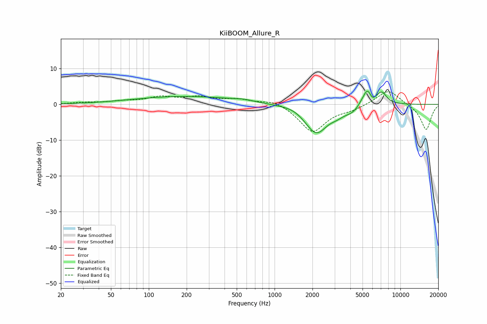

# KiiBOOM_Allure_R
See [usage instructions](https://github.com/jaakkopasanen/AutoEq#usage) for more options and info.

### Parametric EQs
Apply preamp of -3.8 dB when using parametric equalizer.

|   # | Type    |   Fc (Hz) |    Q |   Gain (dB) |
|-----|---------|-----------|------|-------------|
|   1 | Peaking |       198 | 0.33 |         2.2 |
|   2 | Peaking |       564 | 2.16 |         0.4 |
|   3 | Peaking |      1446 | 1.64 |         0.9 |
|   4 | Peaking |      2139 | 1.49 |        -8.2 |
|   5 | Peaking |      3135 | 3.23 |        -0.8 |
|   6 | Peaking |      4288 | 1.8  |        -2.6 |
|   7 | Peaking |      5388 | 2.11 |         4.6 |
|   8 | Peaking |      5459 | 6    |         1.4 |
|   9 | Peaking |      5997 | 6    |        -1.5 |
|  10 | Peaking |      7127 | 3.67 |         2.8 |

### Fixed Band EQs
When using fixed band (also called graphic) equalizer, apply preamp of **-3.6 dB** (if available) and set gains manually with these parameters.

|   # | Type    |   Fc (Hz) |    Q |   Gain (dB) |
|-----|---------|-----------|------|-------------|
|   1 | Peaking |        31 | 1.41 |         0.4 |
|   2 | Peaking |        62 | 1.41 |         0.7 |
|   3 | Peaking |       125 | 1.41 |         1.8 |
|   4 | Peaking |       250 | 1.41 |         1.8 |
|   5 | Peaking |       500 | 1.41 |         1.3 |
|   6 | Peaking |      1000 | 1.41 |         1.4 |
|   7 | Peaking |      2000 | 1.41 |        -7.7 |
|   8 | Peaking |      4000 | 1.41 |        -1.2 |
|   9 | Peaking |      8000 | 1.41 |         4.3 |
|  10 | Peaking |     16000 | 1.41 |        -7.2 |

### Graphs

