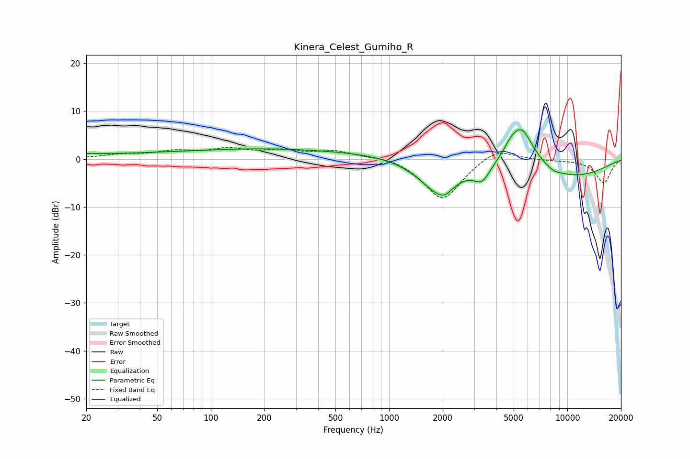

# Kinera_Celest_Gumiho_R
See [usage instructions](https://github.com/jaakkopasanen/AutoEq#usage) for more options and info.

### Parametric EQs
Apply preamp of -6.2 dB when using parametric equalizer.

|   # | Type    |   Fc (Hz) |    Q |   Gain (dB) |
|-----|---------|-----------|------|-------------|
|   1 | Peaking |        20 | 1.35 |         0.5 |
|   2 | Peaking |        84 | 0.26 |         1.2 |
|   3 | Peaking |       644 | 0.18 |         1.5 |
|   4 | Peaking |      1891 | 1.19 |        -7.4 |
|   5 | Peaking |      2046 | 3.74 |        -1.2 |
|   6 | Peaking |      3325 | 2.98 |        -3.5 |
|   7 | Peaking |      4810 | 3.89 |         1.3 |
|   8 | Peaking |      5518 | 1.91 |         8.6 |
|   9 | Peaking |      8395 | 3.47 |        -0.5 |
|  10 | Peaking |     10000 | 0.48 |        -3.9 |

### Fixed Band EQs
When using fixed band (also called graphic) equalizer, apply preamp of **-2.5 dB** (if available) and set gains manually with these parameters.

|   # | Type    |   Fc (Hz) |    Q |   Gain (dB) |
|-----|---------|-----------|------|-------------|
|   1 | Peaking |        31 | 1.41 |         0.8 |
|   2 | Peaking |        62 | 1.41 |         1.4 |
|   3 | Peaking |       125 | 1.41 |         1.8 |
|   4 | Peaking |       250 | 1.41 |         1.5 |
|   5 | Peaking |       500 | 1.41 |         1.6 |
|   6 | Peaking |      1000 | 1.41 |         0.8 |
|   7 | Peaking |      2000 | 1.41 |        -8.7 |
|   8 | Peaking |      4000 | 1.41 |         2.7 |
|   9 | Peaking |      8000 | 1.41 |        -0.2 |
|  10 | Peaking |     16000 | 1.41 |        -5   |

### Graphs

