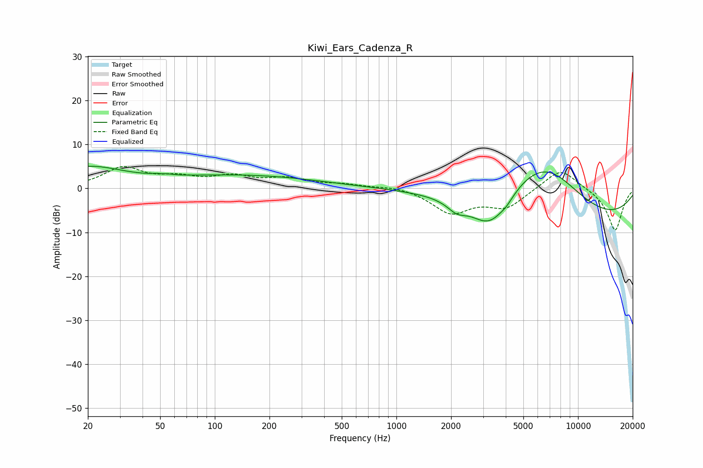

# Kiwi_Ears_Cadenza_R
See [usage instructions](https://github.com/jaakkopasanen/AutoEq#usage) for more options and info.

### Parametric EQs
Apply preamp of -5.1 dB when using parametric equalizer.

|   # | Type    |   Fc (Hz) |    Q |   Gain (dB) |
|-----|---------|-----------|------|-------------|
|   1 | Peaking |        20 | 0.72 |         4.6 |
|   2 | Peaking |        51 | 5.9  |        -2.2 |
|   3 | Peaking |        51 | 5.17 |         2.5 |
|   4 | Peaking |       143 | 0.34 |         2.9 |
|   5 | Peaking |      2146 | 2.77 |        -2.1 |
|   6 | Peaking |      3269 | 1.23 |        -8.8 |
|   7 | Peaking |      4049 | 3.66 |        -1   |
|   8 | Peaking |      5478 | 0.59 |         7.8 |
|   9 | Peaking |      6932 | 0.74 |         6.6 |
|  10 | Peaking |      9356 | 0.24 |        -8.6 |

### Fixed Band EQs
When using fixed band (also called graphic) equalizer, apply preamp of **-5.1 dB** (if available) and set gains manually with these parameters.

|   # | Type    |   Fc (Hz) |    Q |   Gain (dB) |
|-----|---------|-----------|------|-------------|
|   1 | Peaking |        31 | 1.41 |         4.5 |
|   2 | Peaking |        62 | 1.41 |         2   |
|   3 | Peaking |       125 | 1.41 |         2.4 |
|   4 | Peaking |       250 | 1.41 |         2   |
|   5 | Peaking |       500 | 1.41 |         0.8 |
|   6 | Peaking |      1000 | 1.41 |         0.7 |
|   7 | Peaking |      2000 | 1.41 |        -5.4 |
|   8 | Peaking |      4000 | 1.41 |        -4.2 |
|   9 | Peaking |      8000 | 1.41 |         4.9 |
|  10 | Peaking |     16000 | 1.41 |        -9.7 |

### Graphs

