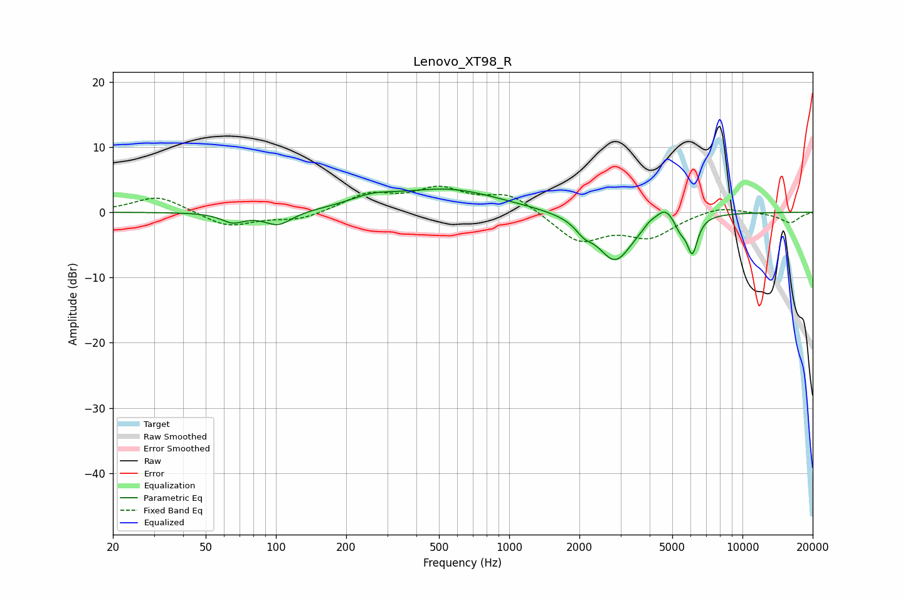

# Lenovo_XT98_R
See [usage instructions](https://github.com/jaakkopasanen/AutoEq#usage) for more options and info.

### Parametric EQs
Apply preamp of -3.7 dB when using parametric equalizer.

|   # | Type    |   Fc (Hz) |    Q |   Gain (dB) |
|-----|---------|-----------|------|-------------|
|   1 | Peaking |        65 | 2.92 |        -1.5 |
|   2 | Peaking |       102 | 2.35 |        -2.1 |
|   3 | Peaking |       258 | 1.46 |         1.4 |
|   4 | Peaking |       547 | 0.63 |         3.4 |
|   5 | Peaking |      2092 | 4.05 |        -1.4 |
|   6 | Peaking |      2845 | 1.8  |        -7.5 |
|   7 | Peaking |      3982 | 5.9  |         0.6 |
|   8 | Peaking |      4637 | 3.56 |         2.3 |
|   9 | Peaking |      5402 | 5.8  |        -1.7 |
|  10 | Peaking |      6094 | 5.88 |        -5.7 |

### Fixed Band EQs
When using fixed band (also called graphic) equalizer, apply preamp of **-4.1 dB** (if available) and set gains manually with these parameters.

|   # | Type    |   Fc (Hz) |    Q |   Gain (dB) |
|-----|---------|-----------|------|-------------|
|   1 | Peaking |        31 | 1.41 |         2.6 |
|   2 | Peaking |        62 | 1.41 |        -2.3 |
|   3 | Peaking |       125 | 1.41 |        -1.2 |
|   4 | Peaking |       250 | 1.41 |         2.6 |
|   5 | Peaking |       500 | 1.41 |         3.2 |
|   6 | Peaking |      1000 | 1.41 |         2.8 |
|   7 | Peaking |      2000 | 1.41 |        -4.5 |
|   8 | Peaking |      4000 | 1.41 |        -3.5 |
|   9 | Peaking |      8000 | 1.41 |         1   |
|  10 | Peaking |     16000 | 1.41 |        -1.6 |

### Graphs

