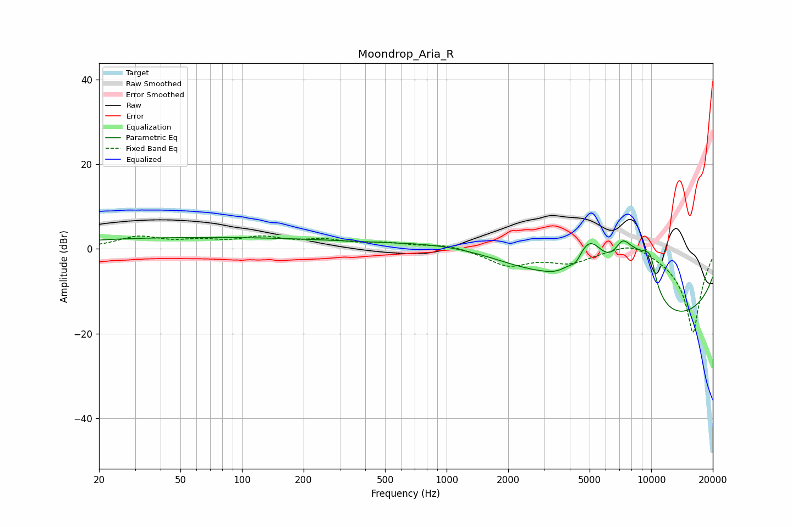

# Moondrop_Aria_R
See [usage instructions](https://github.com/jaakkopasanen/AutoEq#usage) for more options and info.

### Parametric EQs
Apply preamp of -2.8 dB when using parametric equalizer.

|   # | Type    |   Fc (Hz) |    Q |   Gain (dB) |
|-----|---------|-----------|------|-------------|
|   1 | Peaking |        64 | 0.18 |         2.7 |
|   2 | Peaking |      1300 | 0.46 |         4   |
|   3 | Peaking |      3502 | 2.37 |        -1   |
|   4 | Peaking |      4284 | 5.58 |        -1.8 |
|   5 | Peaking |      5005 | 1.42 |        13.6 |
|   6 | Peaking |      7230 | 3.16 |         5.9 |
|   7 | Peaking |      8242 | 1.74 |         7.6 |
|   8 | Peaking |      9499 | 2.53 |         7.2 |
|   9 | Peaking |      9913 | 0.19 |       -18.5 |
|  10 | Peaking |     10000 | 5.99 |         3.1 |

### Fixed Band EQs
When using fixed band (also called graphic) equalizer, apply preamp of **-3.2 dB** (if available) and set gains manually with these parameters.

|   # | Type    |   Fc (Hz) |    Q |   Gain (dB) |
|-----|---------|-----------|------|-------------|
|   1 | Peaking |        31 | 1.41 |         2.7 |
|   2 | Peaking |        62 | 1.41 |         1.5 |
|   3 | Peaking |       125 | 1.41 |         2.3 |
|   4 | Peaking |       250 | 1.41 |         1.7 |
|   5 | Peaking |       500 | 1.41 |         1.2 |
|   6 | Peaking |      1000 | 1.41 |         1.1 |
|   7 | Peaking |      2000 | 1.41 |        -3.8 |
|   8 | Peaking |      4000 | 1.41 |        -2.9 |
|   9 | Peaking |      8000 | 1.41 |         2.5 |
|  10 | Peaking |     16000 | 1.41 |       -20   |

### Graphs

