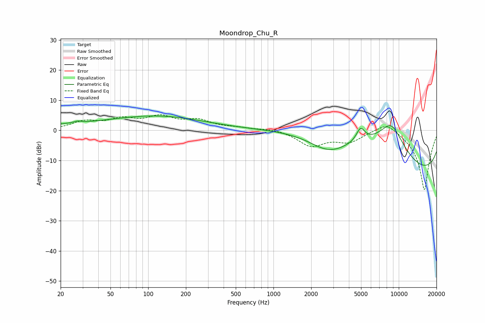

# Moondrop_Chu_R
See [usage instructions](https://github.com/jaakkopasanen/AutoEq#usage) for more options and info.

### Parametric EQs
Apply preamp of -4.9 dB when using parametric equalizer.

|   # | Type    |   Fc (Hz) |    Q |   Gain (dB) |
|-----|---------|-----------|------|-------------|
|   1 | Peaking |        26 | 2.19 |        -0.1 |
|   2 | Peaking |        27 | 5.83 |        -1.4 |
|   3 | Peaking |        27 | 5.17 |         2   |
|   4 | Peaking |        33 | 0.21 |         1.7 |
|   5 | Peaking |       133 | 0.39 |         3.7 |
|   6 | Peaking |      2768 | 0.89 |        -6   |
|   7 | Peaking |      3323 | 0.32 |         9.1 |
|   8 | Peaking |      4955 | 4.06 |         4.5 |
|   9 | Peaking |      8720 | 0.87 |        16.1 |
|  10 | Peaking |     10000 | 0.18 |       -19.6 |

### Fixed Band EQs
When using fixed band (also called graphic) equalizer, apply preamp of **-5.3 dB** (if available) and set gains manually with these parameters.

|   # | Type    |   Fc (Hz) |    Q |   Gain (dB) |
|-----|---------|-----------|------|-------------|
|   1 | Peaking |        31 | 1.41 |         2.7 |
|   2 | Peaking |        62 | 1.41 |         3.2 |
|   3 | Peaking |       125 | 1.41 |         3.9 |
|   4 | Peaking |       250 | 1.41 |         2.9 |
|   5 | Peaking |       500 | 1.41 |         0.7 |
|   6 | Peaking |      1000 | 1.41 |         0.7 |
|   7 | Peaking |      2000 | 1.41 |        -5   |
|   8 | Peaking |      4000 | 1.41 |        -3.4 |
|   9 | Peaking |      8000 | 1.41 |         3.6 |
|  10 | Peaking |     16000 | 1.41 |       -20   |

### Graphs

