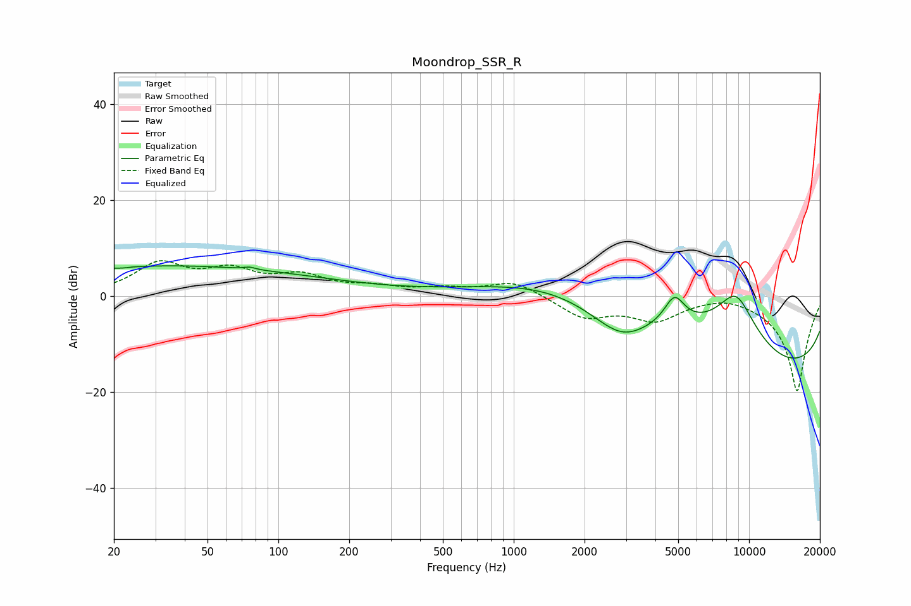

# Moondrop_SSR_R
See [usage instructions](https://github.com/jaakkopasanen/AutoEq#usage) for more options and info.

### Parametric EQs
Apply preamp of -6.3 dB when using parametric equalizer.

|   # | Type    |   Fc (Hz) |    Q |   Gain (dB) |
|-----|---------|-----------|------|-------------|
|   1 | Peaking |        22 | 5.96 |        -0.2 |
|   2 | Peaking |        39 | 0.2  |         6.4 |
|   3 | Peaking |        76 | 6    |         0.5 |
|   4 | Peaking |       126 | 0.41 |        -0.6 |
|   5 | Peaking |      1560 | 0.57 |         2.8 |
|   6 | Peaking |      2885 | 0.77 |       -12.8 |
|   7 | Peaking |      3276 | 0.35 |        14.4 |
|   8 | Peaking |      4821 | 3.18 |         5.9 |
|   9 | Peaking |      8795 | 1.22 |        13.7 |
|  10 | Peaking |     10000 | 0.18 |       -19.9 |

### Fixed Band EQs
When using fixed band (also called graphic) equalizer, apply preamp of **-7.4 dB** (if available) and set gains manually with these parameters.

|   # | Type    |   Fc (Hz) |    Q |   Gain (dB) |
|-----|---------|-----------|------|-------------|
|   1 | Peaking |        31 | 1.41 |         6.3 |
|   2 | Peaking |        62 | 1.41 |         4.5 |
|   3 | Peaking |       125 | 1.41 |         3.6 |
|   4 | Peaking |       250 | 1.41 |         1.5 |
|   5 | Peaking |       500 | 1.41 |         1.2 |
|   6 | Peaking |      1000 | 1.41 |         3.1 |
|   7 | Peaking |      2000 | 1.41 |        -4.4 |
|   8 | Peaking |      4000 | 1.41 |        -4.6 |
|   9 | Peaking |      8000 | 1.41 |         1   |
|  10 | Peaking |     16000 | 1.41 |       -20   |

### Graphs

