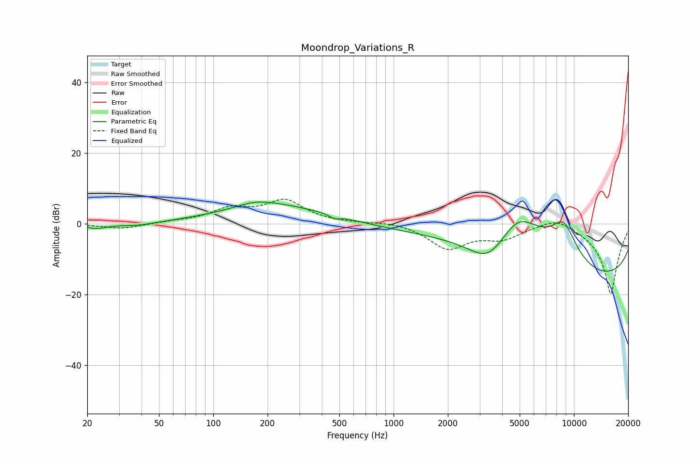

# Moondrop_Variations_R
See [usage instructions](https://github.com/jaakkopasanen/AutoEq#usage) for more options and info.

### Parametric EQs
Apply preamp of -6.3 dB when using parametric equalizer.

|   # | Type    |   Fc (Hz) |    Q |   Gain (dB) |
|-----|---------|-----------|------|-------------|
|   1 | Peaking |        22 | 2.44 |        -1.3 |
|   2 | Peaking |        38 | 1.42 |        -0.9 |
|   3 | Peaking |       170 | 1.44 |         1.4 |
|   4 | Peaking |       191 | 1.38 |         0.1 |
|   5 | Peaking |       226 | 0.47 |         5.1 |
|   6 | Peaking |       470 | 5.42 |        -1   |
|   7 | Peaking |      3365 | 1.15 |        -9.6 |
|   8 | Peaking |      4900 | 0.64 |        20   |
|   9 | Peaking |      8773 | 1.65 |        10.8 |
|  10 | Peaking |     10000 | 0.18 |       -20   |

### Fixed Band EQs
When using fixed band (also called graphic) equalizer, apply preamp of **-7.0 dB** (if available) and set gains manually with these parameters.

|   # | Type    |   Fc (Hz) |    Q |   Gain (dB) |
|-----|---------|-----------|------|-------------|
|   1 | Peaking |        31 | 1.41 |        -1.4 |
|   2 | Peaking |        62 | 1.41 |         0.5 |
|   3 | Peaking |       125 | 1.41 |         3.8 |
|   4 | Peaking |       250 | 1.41 |         6.2 |
|   5 | Peaking |       500 | 1.41 |         0.1 |
|   6 | Peaking |      1000 | 1.41 |         0.7 |
|   7 | Peaking |      2000 | 1.41 |        -6.8 |
|   8 | Peaking |      4000 | 1.41 |        -3.6 |
|   9 | Peaking |      8000 | 1.41 |         2.7 |
|  10 | Peaking |     16000 | 1.41 |       -20   |

### Graphs

