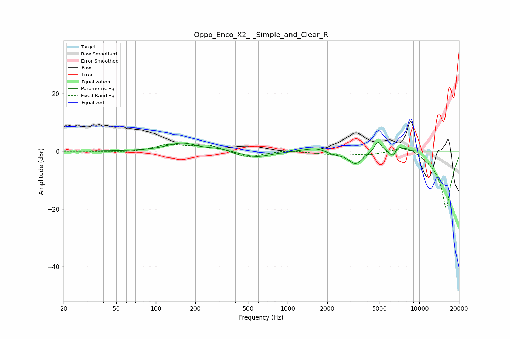

# Oppo_Enco_X2_-_Simple_and_Clear_R
See [usage instructions](https://github.com/jaakkopasanen/AutoEq#usage) for more options and info.

### Parametric EQs
Apply preamp of -3.1 dB when using parametric equalizer.

|   # | Type    |   Fc (Hz) |    Q |   Gain (dB) |
|-----|---------|-----------|------|-------------|
|   1 | Peaking |       158 | 1.23 |         2.9 |
|   2 | Peaking |       297 | 2.16 |         0.7 |
|   3 | Peaking |       578 | 1.34 |        -2.1 |
|   4 | Peaking |      1535 | 1.6  |         1   |
|   5 | Peaking |      1718 | 2.52 |         0.5 |
|   6 | Peaking |      2262 | 2.2  |        -0.9 |
|   7 | Peaking |      3285 | 2.71 |        -4.4 |
|   8 | Peaking |      4857 | 5.08 |         3.8 |
|   9 | Peaking |      6256 | 5.99 |        -2.1 |
|  10 | Peaking |      7066 | 4.38 |         1.8 |

### Fixed Band EQs
When using fixed band (also called graphic) equalizer, apply preamp of **-2.5 dB** (if available) and set gains manually with these parameters.

|   # | Type    |   Fc (Hz) |    Q |   Gain (dB) |
|-----|---------|-----------|------|-------------|
|   1 | Peaking |        31 | 1.41 |        -0.1 |
|   2 | Peaking |        62 | 1.41 |        -0.4 |
|   3 | Peaking |       125 | 1.41 |         2.2 |
|   4 | Peaking |       250 | 1.41 |         2.1 |
|   5 | Peaking |       500 | 1.41 |        -2.3 |
|   6 | Peaking |      1000 | 1.41 |         0.5 |
|   7 | Peaking |      2000 | 1.41 |        -0.9 |
|   8 | Peaking |      4000 | 1.41 |        -1.1 |
|   9 | Peaking |      8000 | 1.41 |         2.8 |
|  10 | Peaking |     16000 | 1.41 |       -20   |

### Graphs

