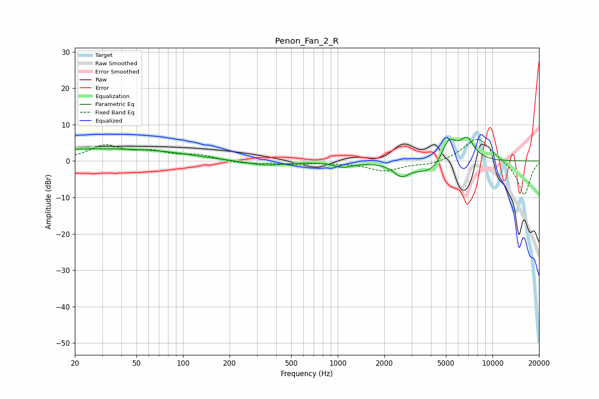

# Penon_Fan_2_R
See [usage instructions](https://github.com/jaakkopasanen/AutoEq#usage) for more options and info.

### Parametric EQs
Apply preamp of -6.7 dB when using parametric equalizer.

|   # | Type    |   Fc (Hz) |    Q |   Gain (dB) |
|-----|---------|-----------|------|-------------|
|   1 | Peaking |        23 | 5.88 |         3.1 |
|   2 | Peaking |        23 | 6    |        -3   |
|   3 | Peaking |        25 | 0.32 |         3.1 |
|   4 | Peaking |        80 | 0.66 |         0.9 |
|   5 | Peaking |       340 | 1.1  |        -1.3 |
|   6 | Peaking |      1079 | 2.3  |        -1.4 |
|   7 | Peaking |      2575 | 2.94 |        -3.1 |
|   8 | Peaking |      4135 | 1.26 |        -4.5 |
|   9 | Peaking |      5211 | 2.59 |         7.6 |
|  10 | Peaking |      6856 | 2.81 |         5.8 |

### Fixed Band EQs
When using fixed band (also called graphic) equalizer, apply preamp of **-6.1 dB** (if available) and set gains manually with these parameters.

|   # | Type    |   Fc (Hz) |    Q |   Gain (dB) |
|-----|---------|-----------|------|-------------|
|   1 | Peaking |        31 | 1.41 |         4   |
|   2 | Peaking |        62 | 1.41 |         2.1 |
|   3 | Peaking |       125 | 1.41 |         1.5 |
|   4 | Peaking |       250 | 1.41 |        -0.7 |
|   5 | Peaking |       500 | 1.41 |        -0.8 |
|   6 | Peaking |      1000 | 1.41 |        -0.3 |
|   7 | Peaking |      2000 | 1.41 |        -2.6 |
|   8 | Peaking |      4000 | 1.41 |        -1.1 |
|   9 | Peaking |      8000 | 1.41 |         6.7 |
|  10 | Peaking |     16000 | 1.41 |        -9.5 |

### Graphs

