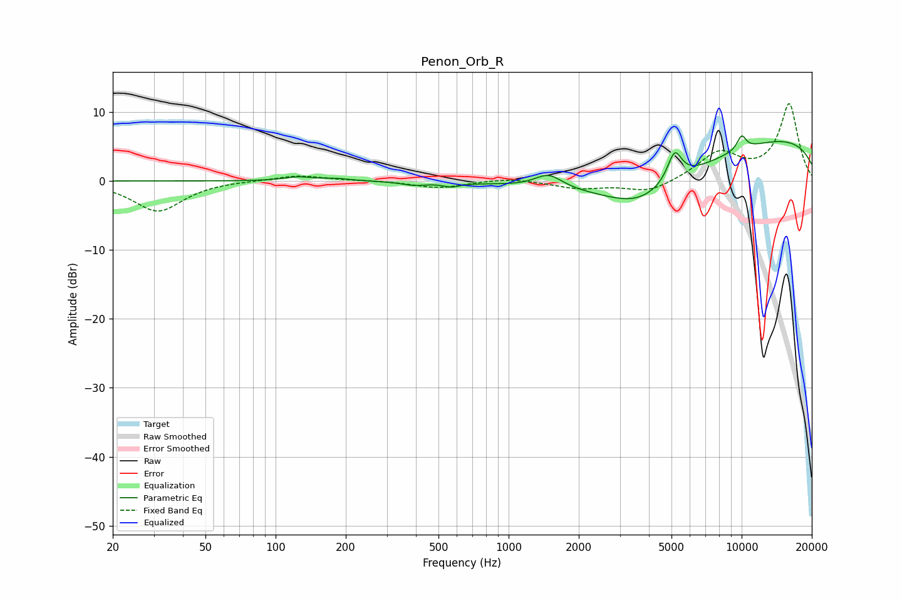

# Penon_Orb_R
See [usage instructions](https://github.com/jaakkopasanen/AutoEq#usage) for more options and info.

### Parametric EQs
Apply preamp of -6.7 dB when using parametric equalizer.

|   # | Type    |   Fc (Hz) |    Q |   Gain (dB) |
|-----|---------|-----------|------|-------------|
|   1 | Peaking |       125 | 2.39 |         0.5 |
|   2 | Peaking |       181 | 2.29 |         0.3 |
|   3 | Peaking |       393 | 2.72 |        -0.5 |
|   4 | Peaking |       567 | 3.98 |        -0.6 |
|   5 | Peaking |      1484 | 2.39 |         2   |
|   6 | Peaking |      3591 | 1.05 |        -2.7 |
|   7 | Peaking |      3763 | 0.39 |        -5.5 |
|   8 | Peaking |      5155 | 4.48 |         4.3 |
|   9 | Peaking |     10000 | 6    |         2.1 |
|  10 | Peaking |     10000 | 0.18 |         7.1 |

### Fixed Band EQs
When using fixed band (also called graphic) equalizer, apply preamp of **-11.3 dB** (if available) and set gains manually with these parameters.

|   # | Type    |   Fc (Hz) |    Q |   Gain (dB) |
|-----|---------|-----------|------|-------------|
|   1 | Peaking |        31 | 1.41 |        -4.4 |
|   2 | Peaking |        62 | 1.41 |         0.1 |
|   3 | Peaking |       125 | 1.41 |         0.9 |
|   4 | Peaking |       250 | 1.41 |         0.1 |
|   5 | Peaking |       500 | 1.41 |        -1   |
|   6 | Peaking |      1000 | 1.41 |         0.5 |
|   7 | Peaking |      2000 | 1.41 |        -1   |
|   8 | Peaking |      4000 | 1.41 |        -1.7 |
|   9 | Peaking |      8000 | 1.41 |         4   |
|  10 | Peaking |     16000 | 1.41 |        11.1 |

### Graphs

