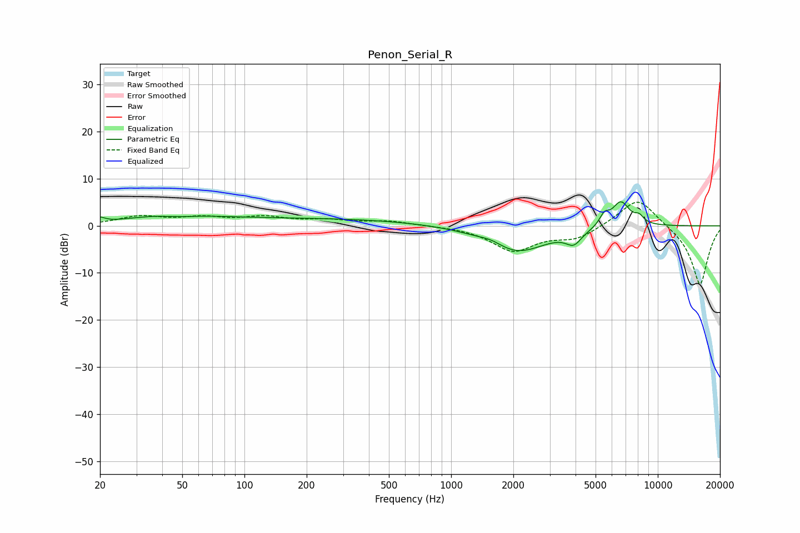

# Penon_Serial_R
See [usage instructions](https://github.com/jaakkopasanen/AutoEq#usage) for more options and info.

### Parametric EQs
Apply preamp of -5.2 dB when using parametric equalizer.

|   # | Type    |   Fc (Hz) |    Q |   Gain (dB) |
|-----|---------|-----------|------|-------------|
|   1 | Peaking |        20 | 5.98 |         0.9 |
|   2 | Peaking |        44 | 0.77 |         2.1 |
|   3 | Peaking |        48 | 1.46 |        -0.9 |
|   4 | Peaking |       207 | 0.24 |         1.5 |
|   5 | Peaking |      1566 | 2.62 |         0.9 |
|   6 | Peaking |      2080 | 0.96 |        -5.7 |
|   7 | Peaking |      3923 | 3.73 |        -2.6 |
|   8 | Peaking |      5511 | 5.96 |         2.2 |
|   9 | Peaking |      6621 | 3.1  |         5.4 |
|  10 | Peaking |      8131 | 5.99 |         1.4 |

### Fixed Band EQs
When using fixed band (also called graphic) equalizer, apply preamp of **-5.1 dB** (if available) and set gains manually with these parameters.

|   # | Type    |   Fc (Hz) |    Q |   Gain (dB) |
|-----|---------|-----------|------|-------------|
|   1 | Peaking |        31 | 1.41 |         1.8 |
|   2 | Peaking |        62 | 1.41 |         1.5 |
|   3 | Peaking |       125 | 1.41 |         1.6 |
|   4 | Peaking |       250 | 1.41 |         1   |
|   5 | Peaking |       500 | 1.41 |         0.9 |
|   6 | Peaking |      1000 | 1.41 |         0   |
|   7 | Peaking |      2000 | 1.41 |        -5.2 |
|   8 | Peaking |      4000 | 1.41 |        -2.6 |
|   9 | Peaking |      8000 | 1.41 |         6.3 |
|  10 | Peaking |     16000 | 1.41 |       -12.7 |

### Graphs

