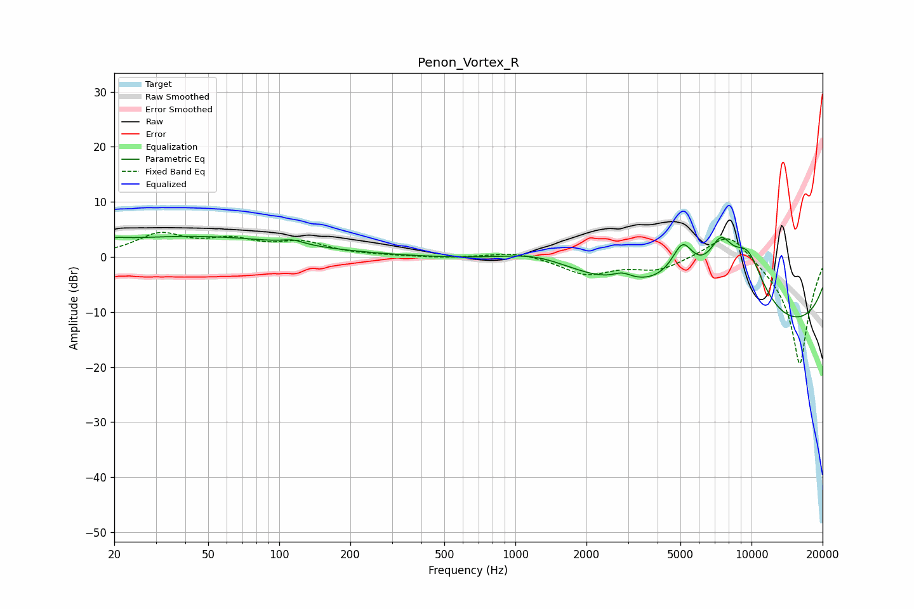

# Penon_Vortex_R
See [usage instructions](https://github.com/jaakkopasanen/AutoEq#usage) for more options and info.

### Parametric EQs
Apply preamp of -3.8 dB when using parametric equalizer.

|   # | Type    |   Fc (Hz) |    Q |   Gain (dB) |
|-----|---------|-----------|------|-------------|
|   1 | Peaking |        20 | 2.89 |         0.6 |
|   2 | Peaking |        42 | 0.32 |         3.7 |
|   3 | Peaking |       115 | 3.27 |         0.7 |
|   4 | Peaking |      1250 | 0.85 |         3.1 |
|   5 | Peaking |      2837 | 3.41 |         1.3 |
|   6 | Peaking |      5105 | 2.93 |         6.6 |
|   7 | Peaking |      5862 | 0.5  |         6.2 |
|   8 | Peaking |      7411 | 2.56 |         7   |
|   9 | Peaking |      9626 | 1.55 |        10.2 |
|  10 | Peaking |     10000 | 0.18 |       -15.5 |

### Fixed Band EQs
When using fixed band (also called graphic) equalizer, apply preamp of **-4.5 dB** (if available) and set gains manually with these parameters.

|   # | Type    |   Fc (Hz) |    Q |   Gain (dB) |
|-----|---------|-----------|------|-------------|
|   1 | Peaking |        31 | 1.41 |         3.9 |
|   2 | Peaking |        62 | 1.41 |         2.6 |
|   3 | Peaking |       125 | 1.41 |         2.4 |
|   4 | Peaking |       250 | 1.41 |         0.1 |
|   5 | Peaking |       500 | 1.41 |        -0.2 |
|   6 | Peaking |      1000 | 1.41 |         1   |
|   7 | Peaking |      2000 | 1.41 |        -3.1 |
|   8 | Peaking |      4000 | 1.41 |        -2.2 |
|   9 | Peaking |      8000 | 1.41 |         5.4 |
|  10 | Peaking |     16000 | 1.41 |       -19.8 |

### Graphs

