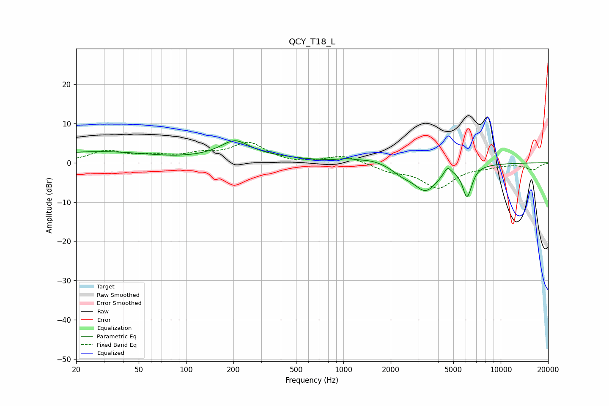

# QCY_T18_L
See [usage instructions](https://github.com/jaakkopasanen/AutoEq#usage) for more options and info.

### Parametric EQs
Apply preamp of -5.7 dB when using parametric equalizer.

|   # | Type    |   Fc (Hz) |    Q |   Gain (dB) |
|-----|---------|-----------|------|-------------|
|   1 | Peaking |        65 | 0.18 |         3.9 |
|   2 | Peaking |        93 | 0.51 |        -2.3 |
|   3 | Peaking |       204 | 1.6  |         3.8 |
|   4 | Peaking |      1038 | 3.23 |         0.6 |
|   5 | Peaking |      1510 | 1.45 |         1.1 |
|   6 | Peaking |      2349 | 2.32 |        -1.5 |
|   7 | Peaking |      3330 | 1.71 |        -6.8 |
|   8 | Peaking |      4585 | 6    |         2.2 |
|   9 | Peaking |      6077 | 4.97 |        -7   |
|  10 | Peaking |      6438 | 5.96 |        -1.1 |

### Fixed Band EQs
When using fixed band (also called graphic) equalizer, apply preamp of **-5.3 dB** (if available) and set gains manually with these parameters.

|   # | Type    |   Fc (Hz) |    Q |   Gain (dB) |
|-----|---------|-----------|------|-------------|
|   1 | Peaking |        31 | 1.41 |         2.8 |
|   2 | Peaking |        62 | 1.41 |         1.4 |
|   3 | Peaking |       125 | 1.41 |         1.8 |
|   4 | Peaking |       250 | 1.41 |         4.8 |
|   5 | Peaking |       500 | 1.41 |        -0.4 |
|   6 | Peaking |      1000 | 1.41 |         2   |
|   7 | Peaking |      2000 | 1.41 |        -1.8 |
|   8 | Peaking |      4000 | 1.41 |        -6.1 |
|   9 | Peaking |      8000 | 1.41 |        -0.7 |
|  10 | Peaking |     16000 | 1.41 |        -1.7 |

### Graphs

