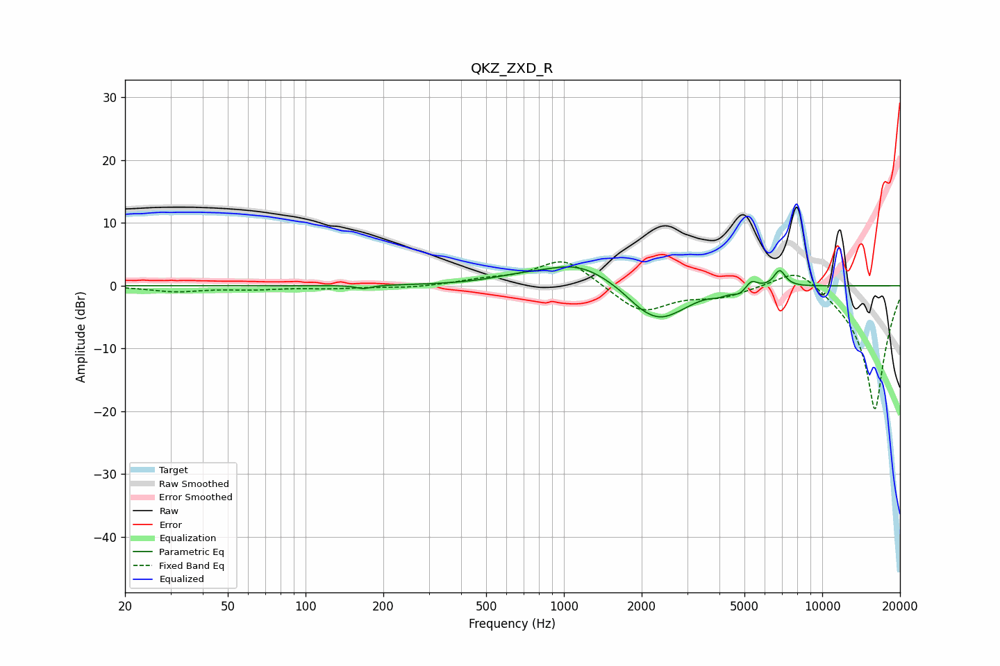

# QKZ_ZXD_R
See [usage instructions](https://github.com/jaakkopasanen/AutoEq#usage) for more options and info.

### Parametric EQs
Apply preamp of -3.1 dB when using parametric equalizer.

|   # | Type    |   Fc (Hz) |    Q |   Gain (dB) |
|-----|---------|-----------|------|-------------|
|   1 | Peaking |       168 | 5.05 |        -0.5 |
|   2 | Peaking |       668 | 1.27 |         0.8 |
|   3 | Peaking |      1135 | 1.05 |         3.5 |
|   4 | Peaking |      2008 | 1.95 |        -1.8 |
|   5 | Peaking |      2467 | 1.51 |        -5   |
|   6 | Peaking |      2621 | 3.22 |         0.3 |
|   7 | Peaking |      3955 | 4.85 |        -0.5 |
|   8 | Peaking |      4797 | 4.87 |        -1   |
|   9 | Peaking |      5308 | 6    |         1.4 |
|  10 | Peaking |      6842 | 6    |         2.6 |

### Fixed Band EQs
When using fixed band (also called graphic) equalizer, apply preamp of **-3.9 dB** (if available) and set gains manually with these parameters.

|   # | Type    |   Fc (Hz) |    Q |   Gain (dB) |
|-----|---------|-----------|------|-------------|
|   1 | Peaking |        31 | 1.41 |        -0.9 |
|   2 | Peaking |        62 | 1.41 |        -0.5 |
|   3 | Peaking |       125 | 1.41 |        -0.4 |
|   4 | Peaking |       250 | 1.41 |        -0.4 |
|   5 | Peaking |       500 | 1.41 |         0.8 |
|   6 | Peaking |      1000 | 1.41 |         4.5 |
|   7 | Peaking |      2000 | 1.41 |        -4.4 |
|   8 | Peaking |      4000 | 1.41 |        -1.5 |
|   9 | Peaking |      8000 | 1.41 |         3.7 |
|  10 | Peaking |     16000 | 1.41 |       -20   |

### Graphs

