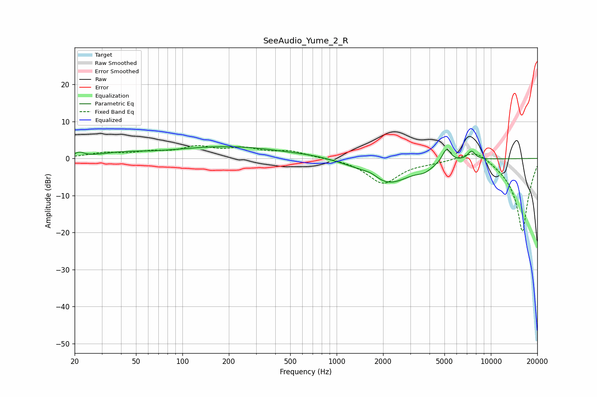

# SeeAudio_Yume_2_R
See [usage instructions](https://github.com/jaakkopasanen/AutoEq#usage) for more options and info.

### Parametric EQs
Apply preamp of -3.3 dB when using parametric equalizer.

|   # | Type    |   Fc (Hz) |    Q |   Gain (dB) |
|-----|---------|-----------|------|-------------|
|   1 | Peaking |        21 | 4.83 |         1.1 |
|   2 | Peaking |        41 | 0.98 |         1   |
|   3 | Peaking |       199 | 0.38 |         3.2 |
|   4 | Peaking |       717 | 1.27 |         0.4 |
|   5 | Peaking |      1662 | 3    |         1   |
|   6 | Peaking |      2061 | 1.78 |        -0.4 |
|   7 | Peaking |      2183 | 0.92 |        -6.4 |
|   8 | Peaking |      3716 | 3.03 |        -1.2 |
|   9 | Peaking |      5156 | 4.96 |         3.9 |
|  10 | Peaking |      7486 | 5.32 |         2.4 |

### Fixed Band EQs
When using fixed band (also called graphic) equalizer, apply preamp of **-3.6 dB** (if available) and set gains manually with these parameters.

|   # | Type    |   Fc (Hz) |    Q |   Gain (dB) |
|-----|---------|-----------|------|-------------|
|   1 | Peaking |        31 | 1.41 |         1.3 |
|   2 | Peaking |        62 | 1.41 |         1.4 |
|   3 | Peaking |       125 | 1.41 |         2.7 |
|   4 | Peaking |       250 | 1.41 |         2.3 |
|   5 | Peaking |       500 | 1.41 |         1.8 |
|   6 | Peaking |      1000 | 1.41 |         0.1 |
|   7 | Peaking |      2000 | 1.41 |        -6.7 |
|   8 | Peaking |      4000 | 1.41 |        -0.7 |
|   9 | Peaking |      8000 | 1.41 |         3.2 |
|  10 | Peaking |     16000 | 1.41 |       -20   |

### Graphs

