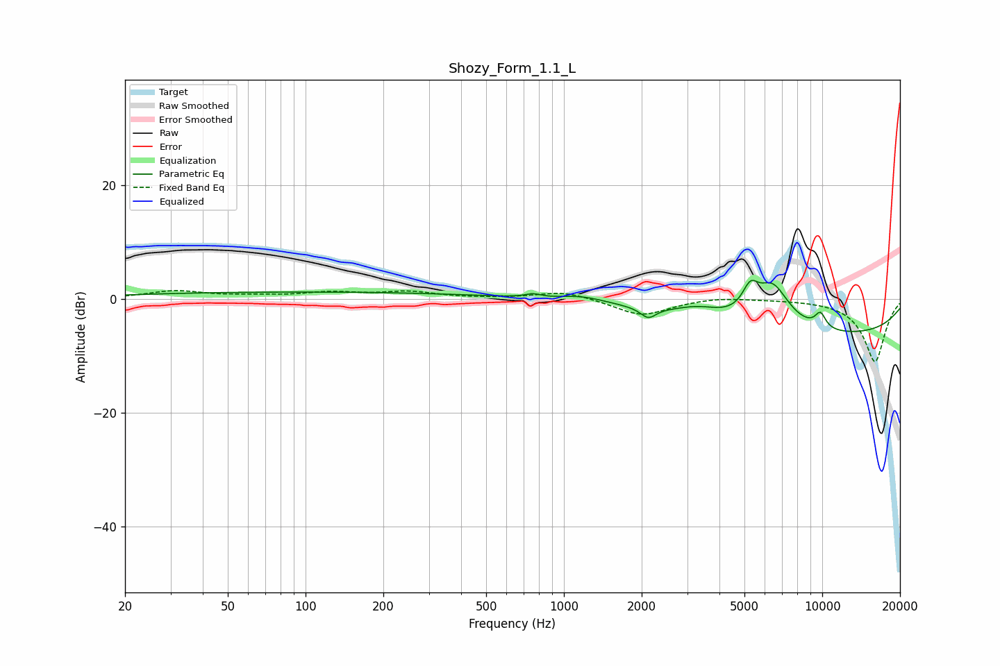

# Shozy_Form_1.1_L
See [usage instructions](https://github.com/jaakkopasanen/AutoEq#usage) for more options and info.

### Parametric EQs
Apply preamp of -3.3 dB when using parametric equalizer.

|   # | Type    |   Fc (Hz) |    Q |   Gain (dB) |
|-----|---------|-----------|------|-------------|
|   1 | Peaking |        98 | 0.18 |         1.2 |
|   2 | Peaking |       757 | 5.11 |         0.6 |
|   3 | Peaking |      1180 | 1.48 |         1.1 |
|   4 | Peaking |      2121 | 4.87 |        -1.8 |
|   5 | Peaking |      3314 | 1.5  |         1.9 |
|   6 | Peaking |      5265 | 4.47 |         4   |
|   7 | Peaking |      6423 | 1.98 |         7.6 |
|   8 | Peaking |      9558 | 3.63 |         0.1 |
|   9 | Peaking |      9840 | 5.84 |         2.6 |
|  10 | Peaking |      9902 | 0.22 |        -6.5 |

### Fixed Band EQs
When using fixed band (also called graphic) equalizer, apply preamp of **-1.6 dB** (if available) and set gains manually with these parameters.

|   # | Type    |   Fc (Hz) |    Q |   Gain (dB) |
|-----|---------|-----------|------|-------------|
|   1 | Peaking |        31 | 1.41 |         1.3 |
|   2 | Peaking |        62 | 1.41 |         0.4 |
|   3 | Peaking |       125 | 1.41 |         1   |
|   4 | Peaking |       250 | 1.41 |         1.2 |
|   5 | Peaking |       500 | 1.41 |         0   |
|   6 | Peaking |      1000 | 1.41 |         1.4 |
|   7 | Peaking |      2000 | 1.41 |        -3   |
|   8 | Peaking |      4000 | 1.41 |         0.5 |
|   9 | Peaking |      8000 | 1.41 |         0   |
|  10 | Peaking |     16000 | 1.41 |       -11   |

### Graphs

