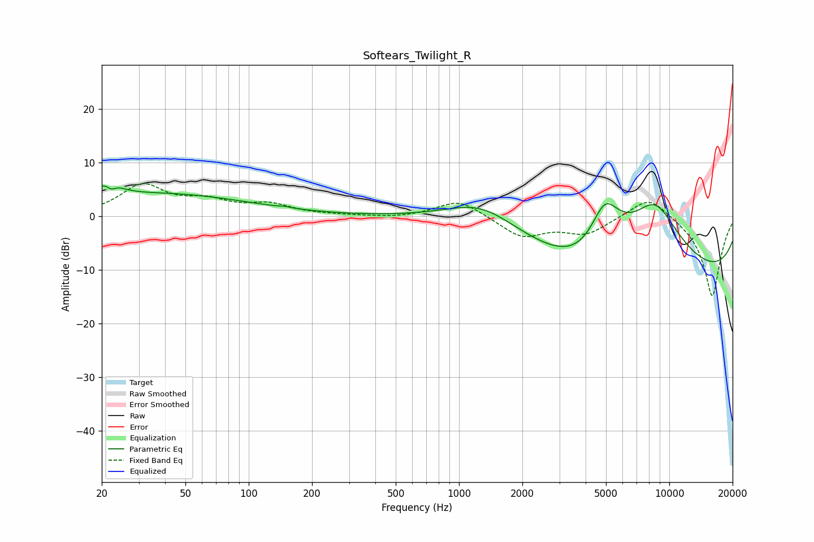

# Softears_Twilight_R
See [usage instructions](https://github.com/jaakkopasanen/AutoEq#usage) for more options and info.

### Parametric EQs
Apply preamp of -5.8 dB when using parametric equalizer.

|   # | Type    |   Fc (Hz) |    Q |   Gain (dB) |
|-----|---------|-----------|------|-------------|
|   1 | Peaking |        20 | 3.89 |        -0.1 |
|   2 | Peaking |        21 | 2.77 |         3.6 |
|   3 | Peaking |        22 | 5.99 |        -1.9 |
|   4 | Peaking |        39 | 0.34 |         4.1 |
|   5 | Peaking |       149 | 5.73 |         0.2 |
|   6 | Peaking |      1286 | 0.82 |         5   |
|   7 | Peaking |      4229 | 0.84 |        -5.8 |
|   8 | Peaking |      4933 | 1.6  |        12.1 |
|   9 | Peaking |      8542 | 0.83 |        14.8 |
|  10 | Peaking |     10000 | 0.18 |       -13.5 |

### Fixed Band EQs
When using fixed band (also called graphic) equalizer, apply preamp of **-6.2 dB** (if available) and set gains manually with these parameters.

|   # | Type    |   Fc (Hz) |    Q |   Gain (dB) |
|-----|---------|-----------|------|-------------|
|   1 | Peaking |        31 | 1.41 |         5.6 |
|   2 | Peaking |        62 | 1.41 |         2.4 |
|   3 | Peaking |       125 | 1.41 |         2   |
|   4 | Peaking |       250 | 1.41 |         0.1 |
|   5 | Peaking |       500 | 1.41 |        -0.3 |
|   6 | Peaking |      1000 | 1.41 |         3.2 |
|   7 | Peaking |      2000 | 1.41 |        -3.8 |
|   8 | Peaking |      4000 | 1.41 |        -3.1 |
|   9 | Peaking |      8000 | 1.41 |         4.2 |
|  10 | Peaking |     16000 | 1.41 |       -15.1 |

### Graphs

