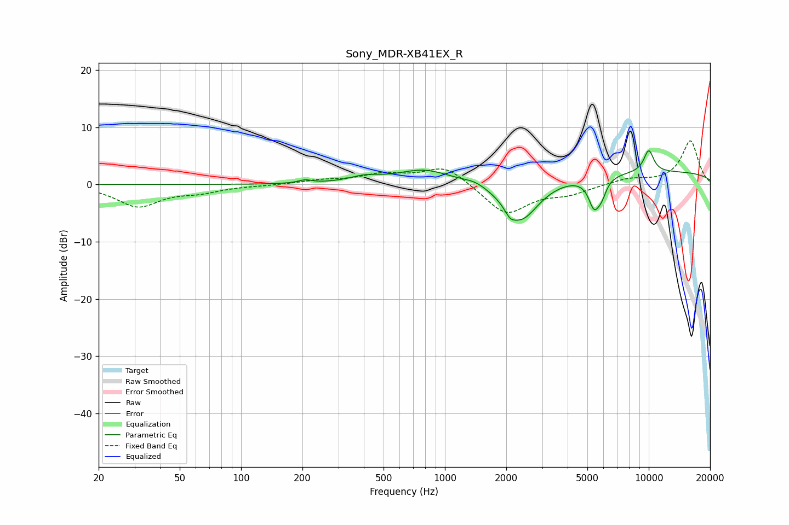

# Sony_MDR-XB41EX_R
See [usage instructions](https://github.com/jaakkopasanen/AutoEq#usage) for more options and info.

### Parametric EQs
Apply preamp of -6.0 dB when using parametric equalizer.

|   # | Type    |   Fc (Hz) |    Q |   Gain (dB) |
|-----|---------|-----------|------|-------------|
|   1 | Peaking |       206 | 4.36 |         0.5 |
|   2 | Peaking |       405 | 1.88 |         1   |
|   3 | Peaking |       790 | 1.08 |         2.5 |
|   4 | Peaking |      1406 | 2.65 |         0.7 |
|   5 | Peaking |      2088 | 5.72 |        -1.3 |
|   6 | Peaking |      2368 | 1.59 |        -7.3 |
|   7 | Peaking |      5395 | 5.04 |        -4.9 |
|   8 | Peaking |      5876 | 5.92 |        -2.2 |
|   9 | Peaking |     10000 | 0.18 |         2.3 |
|  10 | Peaking |     10000 | 4.87 |         3.9 |

### Fixed Band EQs
When using fixed band (also called graphic) equalizer, apply preamp of **-7.7 dB** (if available) and set gains manually with these parameters.

|   # | Type    |   Fc (Hz) |    Q |   Gain (dB) |
|-----|---------|-----------|------|-------------|
|   1 | Peaking |        31 | 1.41 |        -3.8 |
|   2 | Peaking |        62 | 1.41 |        -1.1 |
|   3 | Peaking |       125 | 1.41 |        -0.1 |
|   4 | Peaking |       250 | 1.41 |         0.7 |
|   5 | Peaking |       500 | 1.41 |         1.6 |
|   6 | Peaking |      1000 | 1.41 |         3.3 |
|   7 | Peaking |      2000 | 1.41 |        -5.3 |
|   8 | Peaking |      4000 | 1.41 |        -1.4 |
|   9 | Peaking |      8000 | 1.41 |         1   |
|  10 | Peaking |     16000 | 1.41 |         7.6 |

### Graphs

