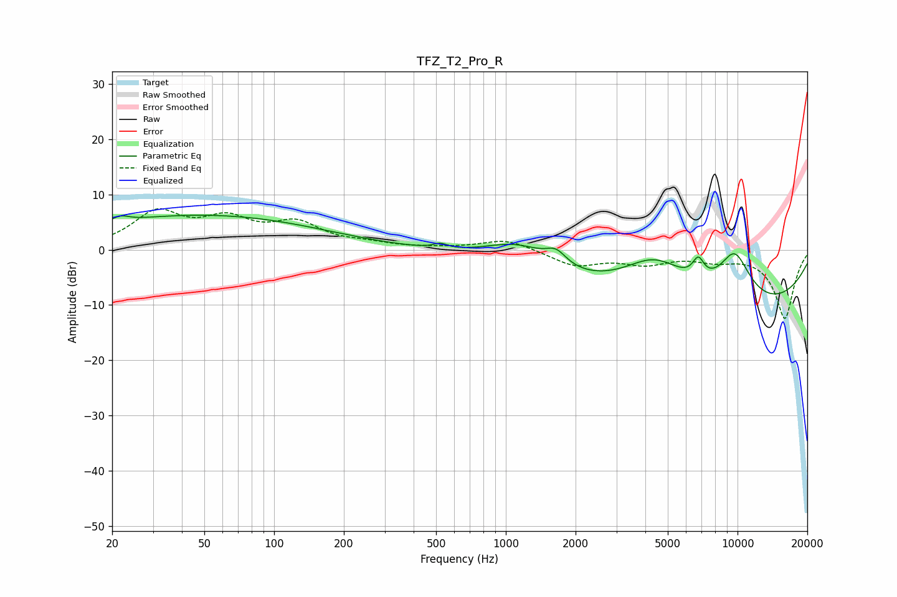

# TFZ_T2_Pro_R
See [usage instructions](https://github.com/jaakkopasanen/AutoEq#usage) for more options and info.

### Parametric EQs
Apply preamp of -6.3 dB when using parametric equalizer.

|   # | Type    |   Fc (Hz) |    Q |   Gain (dB) |
|-----|---------|-----------|------|-------------|
|   1 | Peaking |        22 | 4.23 |         0.9 |
|   2 | Peaking |        31 | 0.18 |         2.2 |
|   3 | Peaking |        54 | 0.29 |         4.1 |
|   4 | Peaking |       522 | 4.91 |         0.8 |
|   5 | Peaking |      1140 | 0.92 |         4.9 |
|   6 | Peaking |      1648 | 3.19 |         2.4 |
|   7 | Peaking |      4393 | 0.85 |         9.3 |
|   8 | Peaking |      6774 | 5.48 |         3.4 |
|   9 | Peaking |      6991 | 0.18 |       -13.2 |
|  10 | Peaking |      9708 | 1.63 |         9.5 |

### Fixed Band EQs
When using fixed band (also called graphic) equalizer, apply preamp of **-7.5 dB** (if available) and set gains manually with these parameters.

|   # | Type    |   Fc (Hz) |    Q |   Gain (dB) |
|-----|---------|-----------|------|-------------|
|   1 | Peaking |        31 | 1.41 |         6.3 |
|   2 | Peaking |        62 | 1.41 |         4.7 |
|   3 | Peaking |       125 | 1.41 |         4.2 |
|   4 | Peaking |       250 | 1.41 |         0.8 |
|   5 | Peaking |       500 | 1.41 |         0.1 |
|   6 | Peaking |      1000 | 1.41 |         1.9 |
|   7 | Peaking |      2000 | 1.41 |        -2.8 |
|   8 | Peaking |      4000 | 1.41 |        -2.2 |
|   9 | Peaking |      8000 | 1.41 |        -1.5 |
|  10 | Peaking |     16000 | 1.41 |       -12.4 |

### Graphs

