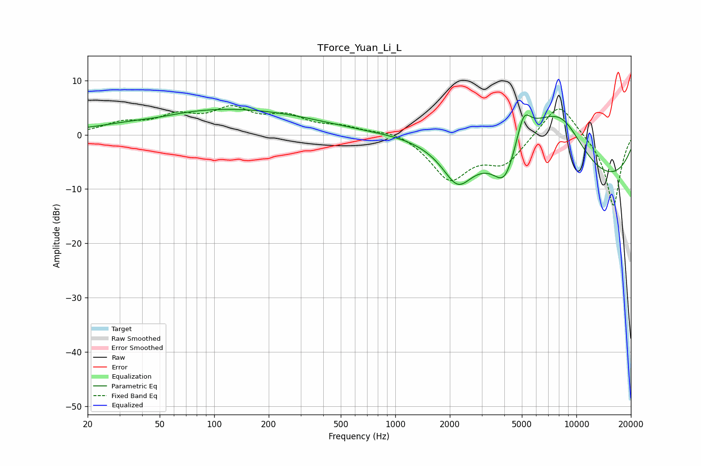

# TForce_Yuan_Li_L
See [usage instructions](https://github.com/jaakkopasanen/AutoEq#usage) for more options and info.

### Parametric EQs
Apply preamp of -4.8 dB when using parametric equalizer.

|   # | Type    |   Fc (Hz) |    Q |   Gain (dB) |
|-----|---------|-----------|------|-------------|
|   1 | Peaking |        49 | 1.18 |        -0.5 |
|   2 | Peaking |       115 | 0.28 |         4.8 |
|   3 | Peaking |      1491 | 0.55 |         3.3 |
|   4 | Peaking |      2208 | 1.92 |        -5.1 |
|   5 | Peaking |      2210 | 0.9  |        -2   |
|   6 | Peaking |      4027 | 2.12 |        -7.4 |
|   7 | Peaking |      5107 | 3.66 |         5   |
|   8 | Peaking |      5584 | 0.59 |        10.5 |
|   9 | Peaking |      7721 | 0.2  |       -13.9 |
|  10 | Peaking |      8335 | 0.88 |         9.2 |

### Fixed Band EQs
When using fixed band (also called graphic) equalizer, apply preamp of **-5.4 dB** (if available) and set gains manually with these parameters.

|   # | Type    |   Fc (Hz) |    Q |   Gain (dB) |
|-----|---------|-----------|------|-------------|
|   1 | Peaking |        31 | 1.41 |         1.9 |
|   2 | Peaking |        62 | 1.41 |         3   |
|   3 | Peaking |       125 | 1.41 |         4.2 |
|   4 | Peaking |       250 | 1.41 |         2.9 |
|   5 | Peaking |       500 | 1.41 |         1.3 |
|   6 | Peaking |      1000 | 1.41 |         1.1 |
|   7 | Peaking |      2000 | 1.41 |        -8   |
|   8 | Peaking |      4000 | 1.41 |        -4.9 |
|   9 | Peaking |      8000 | 1.41 |         6.6 |
|  10 | Peaking |     16000 | 1.41 |       -13.4 |

### Graphs

