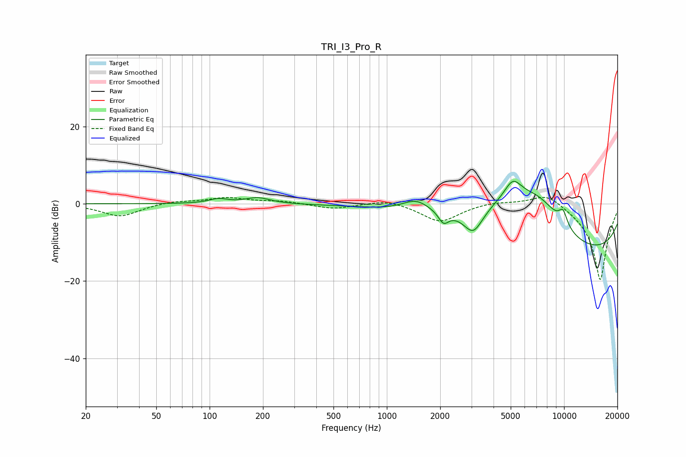

# TRI_I3_Pro_R
See [usage instructions](https://github.com/jaakkopasanen/AutoEq#usage) for more options and info.

### Parametric EQs
Apply preamp of -5.9 dB when using parametric equalizer.

|   # | Type    |   Fc (Hz) |    Q |   Gain (dB) |
|-----|---------|-----------|------|-------------|
|   1 | Peaking |       112 | 2.68 |         1.1 |
|   2 | Peaking |       187 | 2.05 |         1.6 |
|   3 | Peaking |      1468 | 1.77 |         3.3 |
|   4 | Peaking |      2088 | 5.02 |        -3   |
|   5 | Peaking |      3074 | 2.54 |        -6.4 |
|   6 | Peaking |      5124 | 0.52 |        11   |
|   7 | Peaking |      5141 | 2.93 |         4.7 |
|   8 | Peaking |      7231 | 1.01 |         6.7 |
|   9 | Peaking |      9813 | 0.19 |       -15.3 |
|  10 | Peaking |      9868 | 5.01 |         3.8 |

### Fixed Band EQs
When using fixed band (also called graphic) equalizer, apply preamp of **-1.7 dB** (if available) and set gains manually with these parameters.

|   # | Type    |   Fc (Hz) |    Q |   Gain (dB) |
|-----|---------|-----------|------|-------------|
|   1 | Peaking |        31 | 1.41 |        -3.3 |
|   2 | Peaking |        62 | 1.41 |         0.7 |
|   3 | Peaking |       125 | 1.41 |         1.5 |
|   4 | Peaking |       250 | 1.41 |         0.7 |
|   5 | Peaking |       500 | 1.41 |        -1.3 |
|   6 | Peaking |      1000 | 1.41 |         1.2 |
|   7 | Peaking |      2000 | 1.41 |        -4.7 |
|   8 | Peaking |      4000 | 1.41 |         0.7 |
|   9 | Peaking |      8000 | 1.41 |         3.4 |
|  10 | Peaking |     16000 | 1.41 |       -20   |

### Graphs

