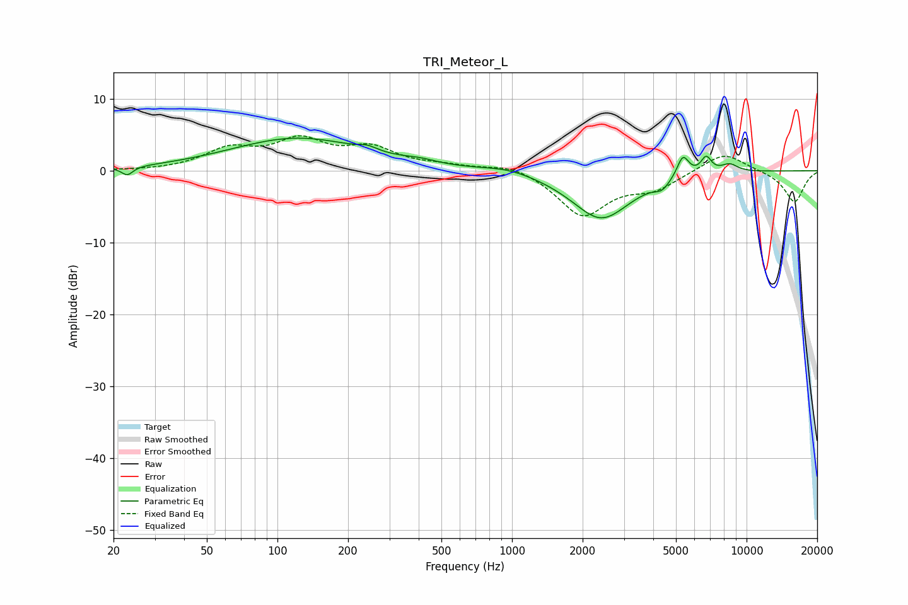

# TRI_Meteor_L
See [usage instructions](https://github.com/jaakkopasanen/AutoEq#usage) for more options and info.

### Parametric EQs
Apply preamp of -4.6 dB when using parametric equalizer.

|   # | Type    |   Fc (Hz) |    Q |   Gain (dB) |
|-----|---------|-----------|------|-------------|
|   1 | Peaking |        23 | 5.96 |        -1.2 |
|   2 | Peaking |       122 | 0.5  |         4.5 |
|   3 | Peaking |       242 | 3.54 |         0.6 |
|   4 | Peaking |       407 | 2.1  |         0.5 |
|   5 | Peaking |       961 | 1.3  |         0.8 |
|   6 | Peaking |      2399 | 1.12 |        -6.7 |
|   7 | Peaking |      4362 | 4.37 |        -1.1 |
|   8 | Peaking |      5352 | 5.45 |         3   |
|   9 | Peaking |      6724 | 6    |         2.2 |
|  10 | Peaking |      8454 | 3.51 |         1.1 |

### Fixed Band EQs
When using fixed band (also called graphic) equalizer, apply preamp of **-5.0 dB** (if available) and set gains manually with these parameters.

|   # | Type    |   Fc (Hz) |    Q |   Gain (dB) |
|-----|---------|-----------|------|-------------|
|   1 | Peaking |        31 | 1.41 |        -0   |
|   2 | Peaking |        62 | 1.41 |         2.7 |
|   3 | Peaking |       125 | 1.41 |         3.8 |
|   4 | Peaking |       250 | 1.41 |         2.8 |
|   5 | Peaking |       500 | 1.41 |         0.6 |
|   6 | Peaking |      1000 | 1.41 |         1.1 |
|   7 | Peaking |      2000 | 1.41 |        -6.2 |
|   8 | Peaking |      4000 | 1.41 |        -2.2 |
|   9 | Peaking |      8000 | 1.41 |         2.7 |
|  10 | Peaking |     16000 | 1.41 |        -4.4 |

### Graphs

