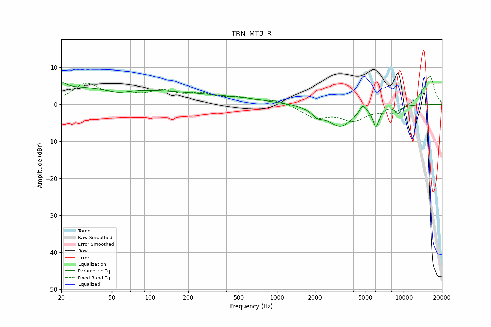

# TRN_MT3_R
See [usage instructions](https://github.com/jaakkopasanen/AutoEq#usage) for more options and info.

### Parametric EQs
Apply preamp of -5.9 dB when using parametric equalizer.

|   # | Type    |   Fc (Hz) |    Q |   Gain (dB) |
|-----|---------|-----------|------|-------------|
|   1 | Peaking |        21 | 5.57 |         3.4 |
|   2 | Peaking |        21 | 5.97 |        -2.3 |
|   3 | Peaking |        22 | 0.21 |         4.6 |
|   4 | Peaking |        56 | 1.52 |        -1.4 |
|   5 | Peaking |       248 | 0.32 |         2.3 |
|   6 | Peaking |      2087 | 3.06 |        -1.9 |
|   7 | Peaking |      3169 | 1.44 |        -5.8 |
|   8 | Peaking |      4767 | 6    |         2.3 |
|   9 | Peaking |      6055 | 5.65 |        -5.1 |
|  10 | Peaking |      9012 | 5.76 |        -2.2 |

### Fixed Band EQs
When using fixed band (also called graphic) equalizer, apply preamp of **-7.8 dB** (if available) and set gains manually with these parameters.

|   # | Type    |   Fc (Hz) |    Q |   Gain (dB) |
|-----|---------|-----------|------|-------------|
|   1 | Peaking |        31 | 1.41 |         5.2 |
|   2 | Peaking |        62 | 1.41 |         2   |
|   3 | Peaking |       125 | 1.41 |         3   |
|   4 | Peaking |       250 | 1.41 |         2.4 |
|   5 | Peaking |       500 | 1.41 |         1.4 |
|   6 | Peaking |      1000 | 1.41 |         1.2 |
|   7 | Peaking |      2000 | 1.41 |        -3.3 |
|   8 | Peaking |      4000 | 1.41 |        -3.8 |
|   9 | Peaking |      8000 | 1.41 |        -2.3 |
|  10 | Peaking |     16000 | 1.41 |         7.9 |

### Graphs

