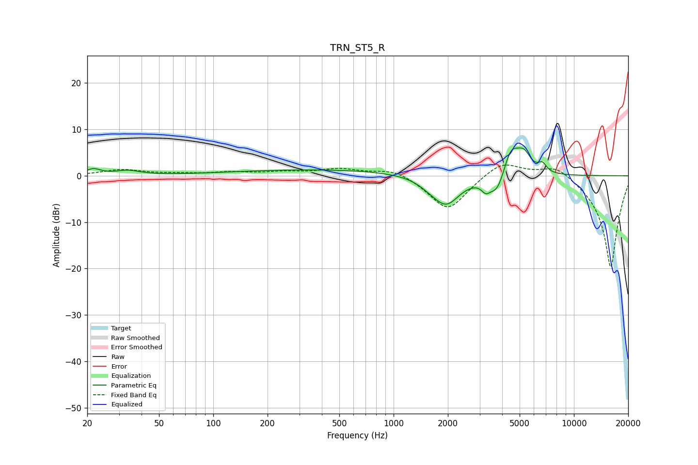

# TRN_ST5_R
See [usage instructions](https://github.com/jaakkopasanen/AutoEq#usage) for more options and info.

### Parametric EQs
Apply preamp of -6.1 dB when using parametric equalizer.

|   # | Type    |   Fc (Hz) |    Q |   Gain (dB) |
|-----|---------|-----------|------|-------------|
|   1 | Peaking |        22 | 3.51 |         1.3 |
|   2 | Peaking |        34 | 2.14 |         1   |
|   3 | Peaking |       394 | 0.28 |         1.3 |
|   4 | Peaking |      1594 | 2.18 |        -1   |
|   5 | Peaking |      1962 | 1.85 |        -6.1 |
|   6 | Peaking |      3245 | 5.86 |        -1.9 |
|   7 | Peaking |      3768 | 3.13 |        -4.7 |
|   8 | Peaking |      4468 | 2.98 |         6.4 |
|   9 | Peaking |      5288 | 3.58 |         3.7 |
|  10 | Peaking |      6687 | 6    |         1.8 |

### Fixed Band EQs
When using fixed band (also called graphic) equalizer, apply preamp of **-2.4 dB** (if available) and set gains manually with these parameters.

|   # | Type    |   Fc (Hz) |    Q |   Gain (dB) |
|-----|---------|-----------|------|-------------|
|   1 | Peaking |        31 | 1.41 |         1.3 |
|   2 | Peaking |        62 | 1.41 |         0.3 |
|   3 | Peaking |       125 | 1.41 |         0.6 |
|   4 | Peaking |       250 | 1.41 |         0.7 |
|   5 | Peaking |       500 | 1.41 |         1.4 |
|   6 | Peaking |      1000 | 1.41 |         1.7 |
|   7 | Peaking |      2000 | 1.41 |        -7.6 |
|   8 | Peaking |      4000 | 1.41 |         3.5 |
|   9 | Peaking |      8000 | 1.41 |         2.8 |
|  10 | Peaking |     16000 | 1.41 |       -20   |

### Graphs

