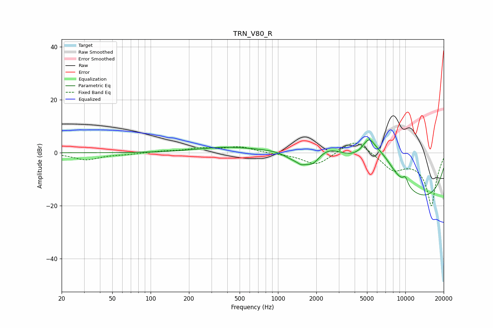

# TRN_V80_R
See [usage instructions](https://github.com/jaakkopasanen/AutoEq#usage) for more options and info.

### Parametric EQs
Apply preamp of -5.0 dB when using parametric equalizer.

|   # | Type    |   Fc (Hz) |    Q |   Gain (dB) |
|-----|---------|-----------|------|-------------|
|   1 | Peaking |       386 | 0.63 |         1.9 |
|   2 | Peaking |      1297 | 1.89 |        -2.8 |
|   3 | Peaking |      1524 | 4.1  |        -1.9 |
|   4 | Peaking |      1873 | 1.96 |        -7.3 |
|   5 | Peaking |      2306 | 0.68 |        11.6 |
|   6 | Peaking |      5177 | 2.35 |         8.3 |
|   7 | Peaking |      6650 | 0.84 |        13.3 |
|   8 | Peaking |      9789 | 0.23 |        -9.2 |
|   9 | Peaking |      9803 | 0.2  |       -11.7 |
|  10 | Peaking |     10000 | 5.83 |         3.1 |

### Fixed Band EQs
When using fixed band (also called graphic) equalizer, apply preamp of **-3.7 dB** (if available) and set gains manually with these parameters.

|   # | Type    |   Fc (Hz) |    Q |   Gain (dB) |
|-----|---------|-----------|------|-------------|
|   1 | Peaking |        31 | 1.41 |        -2.6 |
|   2 | Peaking |        62 | 1.41 |        -0.5 |
|   3 | Peaking |       125 | 1.41 |         0.5 |
|   4 | Peaking |       250 | 1.41 |         1.5 |
|   5 | Peaking |       500 | 1.41 |         2.2 |
|   6 | Peaking |      1000 | 1.41 |        -0.3 |
|   7 | Peaking |      2000 | 1.41 |        -4.8 |
|   8 | Peaking |      4000 | 1.41 |         5.7 |
|   9 | Peaking |      8000 | 1.41 |        -5.7 |
|  10 | Peaking |     16000 | 1.41 |       -20   |

### Graphs

