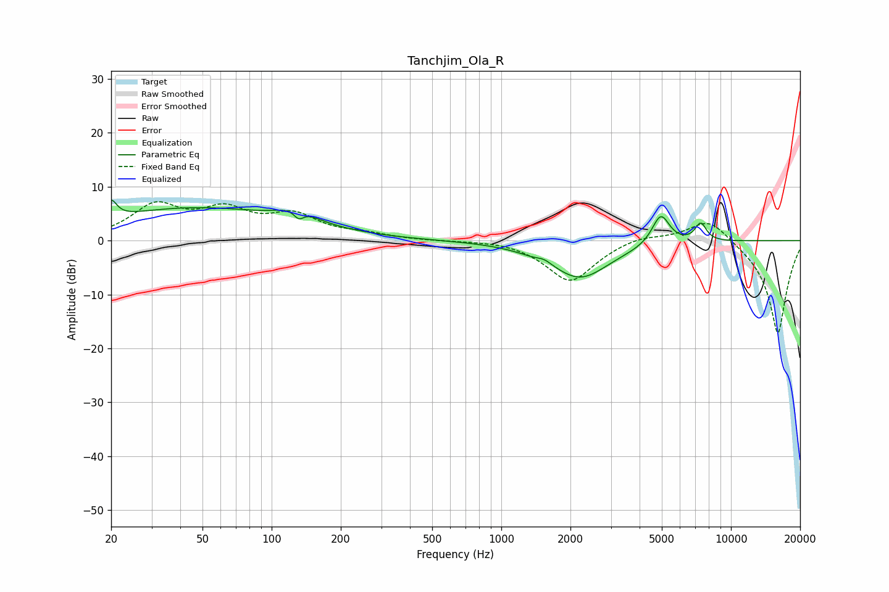

# Tanchjim_Ola_R
See [usage instructions](https://github.com/jaakkopasanen/AutoEq#usage) for more options and info.

### Parametric EQs
Apply preamp of -7.6 dB when using parametric equalizer.

|   # | Type    |   Fc (Hz) |    Q |   Gain (dB) |
|-----|---------|-----------|------|-------------|
|   1 | Peaking |        20 | 5.95 |         3.2 |
|   2 | Peaking |        46 | 0.33 |         6   |
|   3 | Peaking |       129 | 1.89 |         2.5 |
|   4 | Peaking |       131 | 5.99 |        -1.9 |
|   5 | Peaking |      1407 | 2.23 |        -0.4 |
|   6 | Peaking |      1535 | 4.23 |         0.8 |
|   7 | Peaking |      2202 | 1.09 |        -6.9 |
|   8 | Peaking |      4933 | 3.6  |         4.6 |
|   9 | Peaking |      5002 | 3.8  |         1.1 |
|  10 | Peaking |      7382 | 5.32 |         3.3 |

### Fixed Band EQs
When using fixed band (also called graphic) equalizer, apply preamp of **-7.3 dB** (if available) and set gains manually with these parameters.

|   # | Type    |   Fc (Hz) |    Q |   Gain (dB) |
|-----|---------|-----------|------|-------------|
|   1 | Peaking |        31 | 1.41 |         6.1 |
|   2 | Peaking |        62 | 1.41 |         4.9 |
|   3 | Peaking |       125 | 1.41 |         4.2 |
|   4 | Peaking |       250 | 1.41 |         1   |
|   5 | Peaking |       500 | 1.41 |        -0   |
|   6 | Peaking |      1000 | 1.41 |         0.3 |
|   7 | Peaking |      2000 | 1.41 |        -7.7 |
|   8 | Peaking |      4000 | 1.41 |         1.2 |
|   9 | Peaking |      8000 | 1.41 |         4.6 |
|  10 | Peaking |     16000 | 1.41 |       -17.5 |

### Graphs

