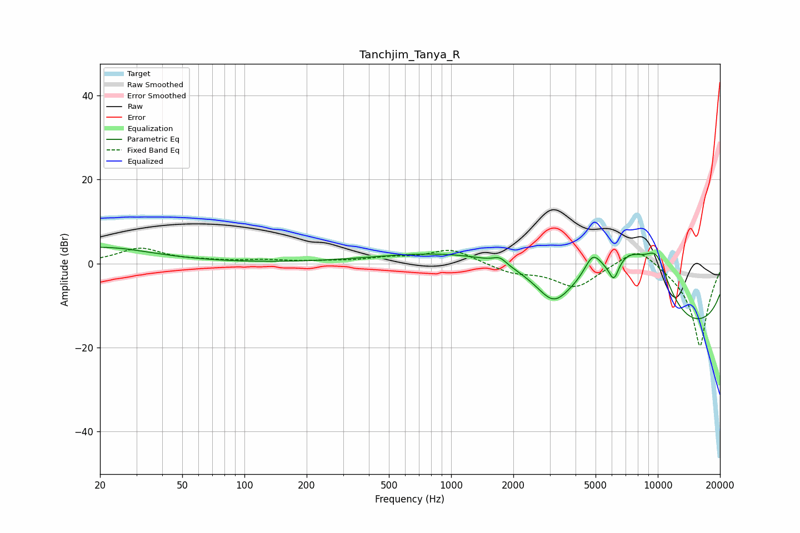

# Tanchjim_Tanya_R
See [usage instructions](https://github.com/jaakkopasanen/AutoEq#usage) for more options and info.

### Parametric EQs
Apply preamp of -3.9 dB when using parametric equalizer.

|   # | Type    |   Fc (Hz) |    Q |   Gain (dB) |
|-----|---------|-----------|------|-------------|
|   1 | Peaking |        20 | 0.58 |         3.8 |
|   2 | Peaking |      1722 | 4.35 |         1.6 |
|   3 | Peaking |      2192 | 0.29 |         8.7 |
|   4 | Peaking |      3110 | 1.31 |        -4.5 |
|   5 | Peaking |      3131 | 2.25 |        -3   |
|   6 | Peaking |      4852 | 3.13 |         5.9 |
|   7 | Peaking |      6130 | 5.89 |        -4.5 |
|   8 | Peaking |      7248 | 1.01 |        12.3 |
|   9 | Peaking |      9858 | 1.62 |        11.9 |
|  10 | Peaking |     10000 | 0.18 |       -19.7 |

### Fixed Band EQs
When using fixed band (also called graphic) equalizer, apply preamp of **-3.7 dB** (if available) and set gains manually with these parameters.

|   # | Type    |   Fc (Hz) |    Q |   Gain (dB) |
|-----|---------|-----------|------|-------------|
|   1 | Peaking |        31 | 1.41 |         3.5 |
|   2 | Peaking |        62 | 1.41 |         0.4 |
|   3 | Peaking |       125 | 1.41 |         0.7 |
|   4 | Peaking |       250 | 1.41 |         0.4 |
|   5 | Peaking |       500 | 1.41 |         1.1 |
|   6 | Peaking |      1000 | 1.41 |         3.4 |
|   7 | Peaking |      2000 | 1.41 |        -2.1 |
|   8 | Peaking |      4000 | 1.41 |        -5.6 |
|   9 | Peaking |      8000 | 1.41 |         5   |
|  10 | Peaking |     16000 | 1.41 |       -20   |

### Graphs

