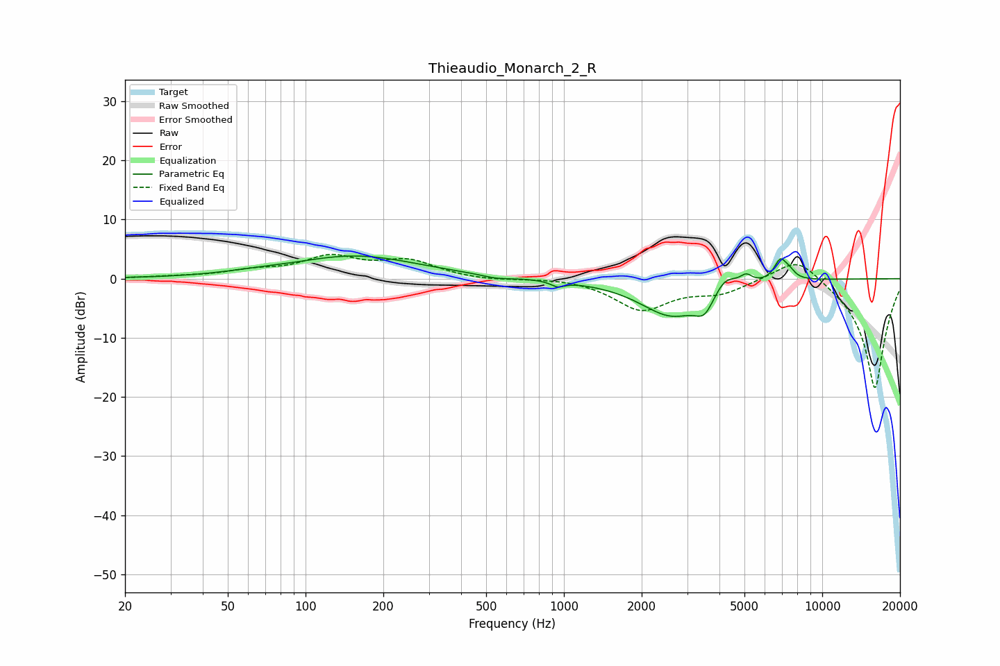

# Thieaudio_Monarch_2_R
See [usage instructions](https://github.com/jaakkopasanen/AutoEq#usage) for more options and info.

### Parametric EQs
Apply preamp of -3.9 dB when using parametric equalizer.

|   # | Type    |   Fc (Hz) |    Q |   Gain (dB) |
|-----|---------|-----------|------|-------------|
|   1 | Peaking |        62 | 1.18 |         0.3 |
|   2 | Peaking |       156 | 0.58 |         3.8 |
|   3 | Peaking |       548 | 2.53 |        -0.5 |
|   4 | Peaking |       946 | 5.41 |        -0.9 |
|   5 | Peaking |      2614 | 1.14 |        -6.2 |
|   6 | Peaking |      3503 | 3.9  |        -3.1 |
|   7 | Peaking |      4204 | 3.16 |         2.7 |
|   8 | Peaking |      5074 | 6    |         1.5 |
|   9 | Peaking |      6880 | 5.58 |         3.4 |
|  10 | Peaking |      7455 | 6    |         1.1 |

### Fixed Band EQs
When using fixed band (also called graphic) equalizer, apply preamp of **-4.2 dB** (if available) and set gains manually with these parameters.

|   # | Type    |   Fc (Hz) |    Q |   Gain (dB) |
|-----|---------|-----------|------|-------------|
|   1 | Peaking |        31 | 1.41 |         0.2 |
|   2 | Peaking |        62 | 1.41 |         1.1 |
|   3 | Peaking |       125 | 1.41 |         3.4 |
|   4 | Peaking |       250 | 1.41 |         2.8 |
|   5 | Peaking |       500 | 1.41 |        -0.3 |
|   6 | Peaking |      1000 | 1.41 |         0.3 |
|   7 | Peaking |      2000 | 1.41 |        -5.1 |
|   8 | Peaking |      4000 | 1.41 |        -2.1 |
|   9 | Peaking |      8000 | 1.41 |         4.4 |
|  10 | Peaking |     16000 | 1.41 |       -18.8 |

### Graphs

