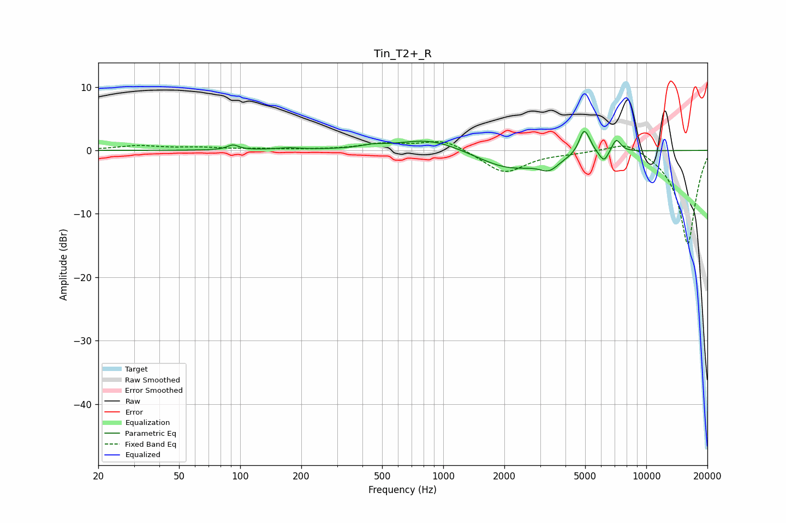

# Tin_T2+_R
See [usage instructions](https://github.com/jaakkopasanen/AutoEq#usage) for more options and info.

### Parametric EQs
Apply preamp of -3.1 dB when using parametric equalizer.

|   # | Type    |   Fc (Hz) |    Q |   Gain (dB) |
|-----|---------|-----------|------|-------------|
|   1 | Peaking |        92 | 5.01 |         0.8 |
|   2 | Peaking |       173 | 2.29 |         0.3 |
|   3 | Peaking |       448 | 2.58 |         0.4 |
|   4 | Peaking |       868 | 0.89 |         2   |
|   5 | Peaking |      2115 | 0.89 |        -3   |
|   6 | Peaking |      3327 | 2.92 |        -1.8 |
|   7 | Peaking |      4907 | 5.95 |         3.2 |
|   8 | Peaking |      5177 | 5.99 |         1.1 |
|   9 | Peaking |      6191 | 5.99 |        -1.8 |
|  10 | Peaking |      7113 | 6    |         2.1 |

### Fixed Band EQs
When using fixed band (also called graphic) equalizer, apply preamp of **-1.5 dB** (if available) and set gains manually with these parameters.

|   # | Type    |   Fc (Hz) |    Q |   Gain (dB) |
|-----|---------|-----------|------|-------------|
|   1 | Peaking |        31 | 1.41 |         0.7 |
|   2 | Peaking |        62 | 1.41 |         0.4 |
|   3 | Peaking |       125 | 1.41 |         0.2 |
|   4 | Peaking |       250 | 1.41 |         0.1 |
|   5 | Peaking |       500 | 1.41 |         1   |
|   6 | Peaking |      1000 | 1.41 |         1.8 |
|   7 | Peaking |      2000 | 1.41 |        -3.6 |
|   8 | Peaking |      4000 | 1.41 |        -0.3 |
|   9 | Peaking |      8000 | 1.41 |         1.8 |
|  10 | Peaking |     16000 | 1.41 |       -14.9 |

### Graphs

