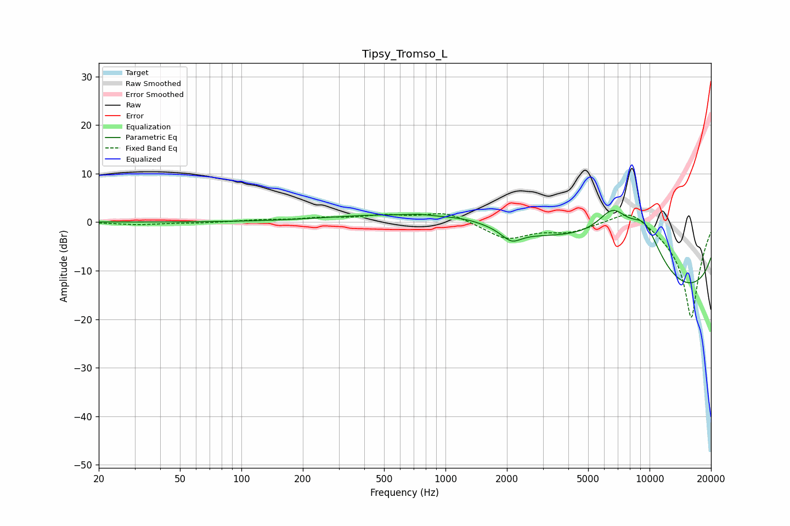

# Tipsy_Tromso_L
See [usage instructions](https://github.com/jaakkopasanen/AutoEq#usage) for more options and info.

### Parametric EQs
Apply preamp of -2.5 dB when using parametric equalizer.

|   # | Type    |   Fc (Hz) |    Q |   Gain (dB) |
|-----|---------|-----------|------|-------------|
|   1 | Peaking |       462 | 0.48 |         0.5 |
|   2 | Peaking |       668 | 0.46 |         1.7 |
|   3 | Peaking |       741 | 2.71 |         0.3 |
|   4 | Peaking |      1289 | 0.86 |         2.2 |
|   5 | Peaking |      2096 | 2.98 |        -1.3 |
|   6 | Peaking |      2117 | 3.01 |        -1   |
|   7 | Peaking |      5389 | 0.38 |        10.5 |
|   8 | Peaking |      6611 | 1.72 |         6.6 |
|   9 | Peaking |      9454 | 1.33 |         9.9 |
|  10 | Peaking |     10000 | 0.18 |       -20   |

### Fixed Band EQs
When using fixed band (also called graphic) equalizer, apply preamp of **-1.8 dB** (if available) and set gains manually with these parameters.

|   # | Type    |   Fc (Hz) |    Q |   Gain (dB) |
|-----|---------|-----------|------|-------------|
|   1 | Peaking |        31 | 1.41 |        -0.5 |
|   2 | Peaking |        62 | 1.41 |        -0.2 |
|   3 | Peaking |       125 | 1.41 |         0.4 |
|   4 | Peaking |       250 | 1.41 |         0.7 |
|   5 | Peaking |       500 | 1.41 |         1.2 |
|   6 | Peaking |      1000 | 1.41 |         2.1 |
|   7 | Peaking |      2000 | 1.41 |        -3.4 |
|   8 | Peaking |      4000 | 1.41 |        -1.8 |
|   9 | Peaking |      8000 | 1.41 |         3.5 |
|  10 | Peaking |     16000 | 1.41 |       -20   |

### Graphs

