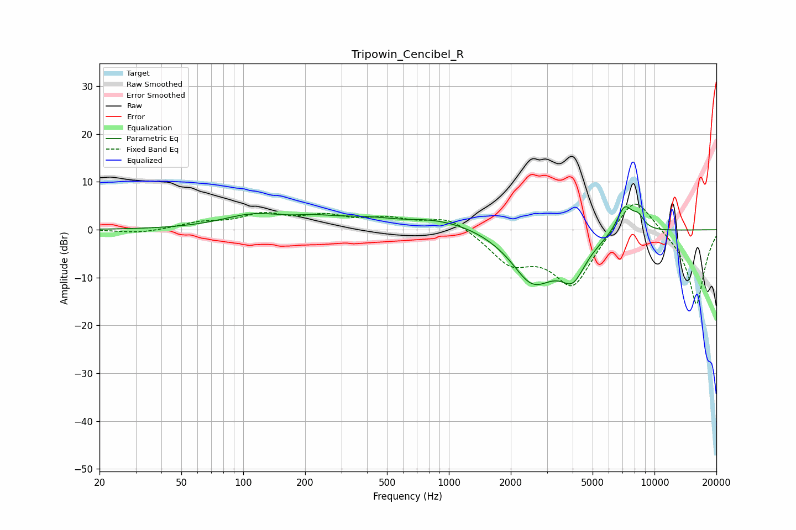

# Tripowin_Cencibel_R
See [usage instructions](https://github.com/jaakkopasanen/AutoEq#usage) for more options and info.

### Parametric EQs
Apply preamp of -4.9 dB when using parametric equalizer.

|   # | Type    |   Fc (Hz) |    Q |   Gain (dB) |
|-----|---------|-----------|------|-------------|
|   1 | Peaking |       111 | 0.94 |         2.6 |
|   2 | Peaking |       217 | 1.81 |         0.6 |
|   3 | Peaking |       585 | 1.25 |        -1   |
|   4 | Peaking |       681 | 0.36 |         3.7 |
|   5 | Peaking |      2380 | 2.45 |        -0.9 |
|   6 | Peaking |      2604 | 1.12 |       -10.8 |
|   7 | Peaking |      4017 | 2.31 |        -6.7 |
|   8 | Peaking |      7148 | 3.32 |         5.9 |
|   9 | Peaking |      7324 | 3.66 |         0   |
|  10 | Peaking |      8340 | 4.4  |         2.4 |

### Fixed Band EQs
When using fixed band (also called graphic) equalizer, apply preamp of **-5.4 dB** (if available) and set gains manually with these parameters.

|   # | Type    |   Fc (Hz) |    Q |   Gain (dB) |
|-----|---------|-----------|------|-------------|
|   1 | Peaking |        31 | 1.41 |        -0.8 |
|   2 | Peaking |        62 | 1.41 |         1.3 |
|   3 | Peaking |       125 | 1.41 |         2.9 |
|   4 | Peaking |       250 | 1.41 |         2.5 |
|   5 | Peaking |       500 | 1.41 |         2   |
|   6 | Peaking |      1000 | 1.41 |         2.9 |
|   7 | Peaking |      2000 | 1.41 |        -6.2 |
|   8 | Peaking |      4000 | 1.41 |       -11.8 |
|   9 | Peaking |      8000 | 1.41 |         8.7 |
|  10 | Peaking |     16000 | 1.41 |       -15.9 |

### Graphs

