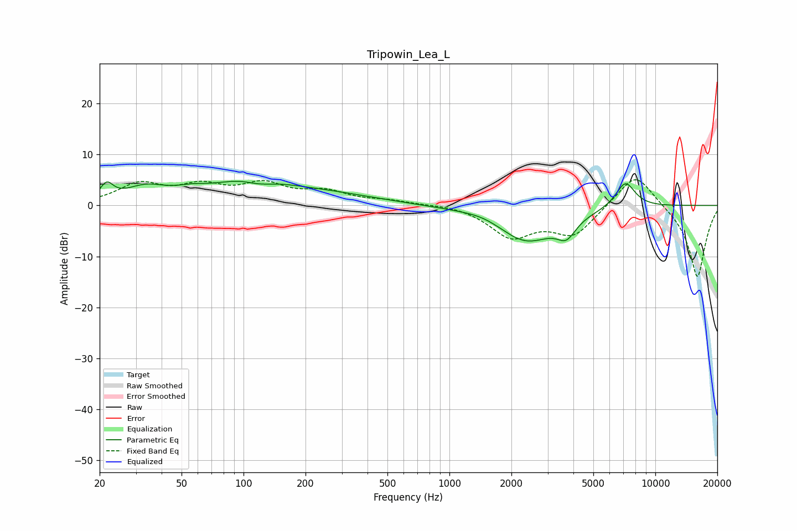

# Tripowin_Lea_L
See [usage instructions](https://github.com/jaakkopasanen/AutoEq#usage) for more options and info.

### Parametric EQs
Apply preamp of -4.8 dB when using parametric equalizer.

|   # | Type    |   Fc (Hz) |    Q |   Gain (dB) |
|-----|---------|-----------|------|-------------|
|   1 | Peaking |        22 | 4.56 |         3   |
|   2 | Peaking |        33 | 1.4  |         3   |
|   3 | Peaking |        56 | 1.91 |         1.1 |
|   4 | Peaking |       106 | 0.79 |         4.5 |
|   5 | Peaking |       118 | 1.9  |        -1.4 |
|   6 | Peaking |       249 | 0.53 |         1.9 |
|   7 | Peaking |      1478 | 1.47 |         0.9 |
|   8 | Peaking |      2356 | 0.95 |        -7.1 |
|   9 | Peaking |      3700 | 3.14 |        -3.4 |
|  10 | Peaking |      7151 | 2.78 |         5.2 |

### Fixed Band EQs
When using fixed band (also called graphic) equalizer, apply preamp of **-5.1 dB** (if available) and set gains manually with these parameters.

|   # | Type    |   Fc (Hz) |    Q |   Gain (dB) |
|-----|---------|-----------|------|-------------|
|   1 | Peaking |        31 | 1.41 |         3.9 |
|   2 | Peaking |        62 | 1.41 |         3.3 |
|   3 | Peaking |       125 | 1.41 |         3.7 |
|   4 | Peaking |       250 | 1.41 |         2.4 |
|   5 | Peaking |       500 | 1.41 |         0.8 |
|   6 | Peaking |      1000 | 1.41 |         0.4 |
|   7 | Peaking |      2000 | 1.41 |        -5.9 |
|   8 | Peaking |      4000 | 1.41 |        -5.6 |
|   9 | Peaking |      8000 | 1.41 |         7   |
|  10 | Peaking |     16000 | 1.41 |       -14.3 |

### Graphs

