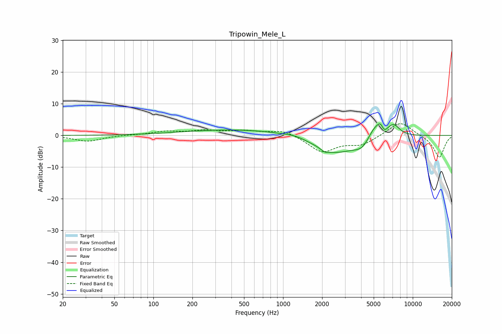

# Tripowin_Mele_L
See [usage instructions](https://github.com/jaakkopasanen/AutoEq#usage) for more options and info.

### Parametric EQs
Apply preamp of -3.8 dB when using parametric equalizer.

|   # | Type    |   Fc (Hz) |    Q |   Gain (dB) |
|-----|---------|-----------|------|-------------|
|   1 | Peaking |       481 | 0.31 |         1.9 |
|   2 | Peaking |      1229 | 1.98 |         0.6 |
|   3 | Peaking |      2093 | 5    |        -0.9 |
|   4 | Peaking |      2526 | 0.84 |        -5.7 |
|   5 | Peaking |      4092 | 2.22 |        -3   |
|   6 | Peaking |      5121 | 2.24 |         4.8 |
|   7 | Peaking |      5645 | 6    |         2   |
|   8 | Peaking |      6005 | 6    |        -1.7 |
|   9 | Peaking |      6770 | 2.97 |         0.5 |
|  10 | Peaking |      7155 | 2.9  |         3   |

### Fixed Band EQs
When using fixed band (also called graphic) equalizer, apply preamp of **-3.8 dB** (if available) and set gains manually with these parameters.

|   # | Type    |   Fc (Hz) |    Q |   Gain (dB) |
|-----|---------|-----------|------|-------------|
|   1 | Peaking |        31 | 1.41 |        -1.9 |
|   2 | Peaking |        62 | 1.41 |         0.1 |
|   3 | Peaking |       125 | 1.41 |         1.1 |
|   4 | Peaking |       250 | 1.41 |         1.3 |
|   5 | Peaking |       500 | 1.41 |         1.3 |
|   6 | Peaking |      1000 | 1.41 |         1.8 |
|   7 | Peaking |      2000 | 1.41 |        -5.2 |
|   8 | Peaking |      4000 | 1.41 |        -2.8 |
|   9 | Peaking |      8000 | 1.41 |         4.6 |
|  10 | Peaking |     16000 | 1.41 |        -7.1 |

### Graphs

