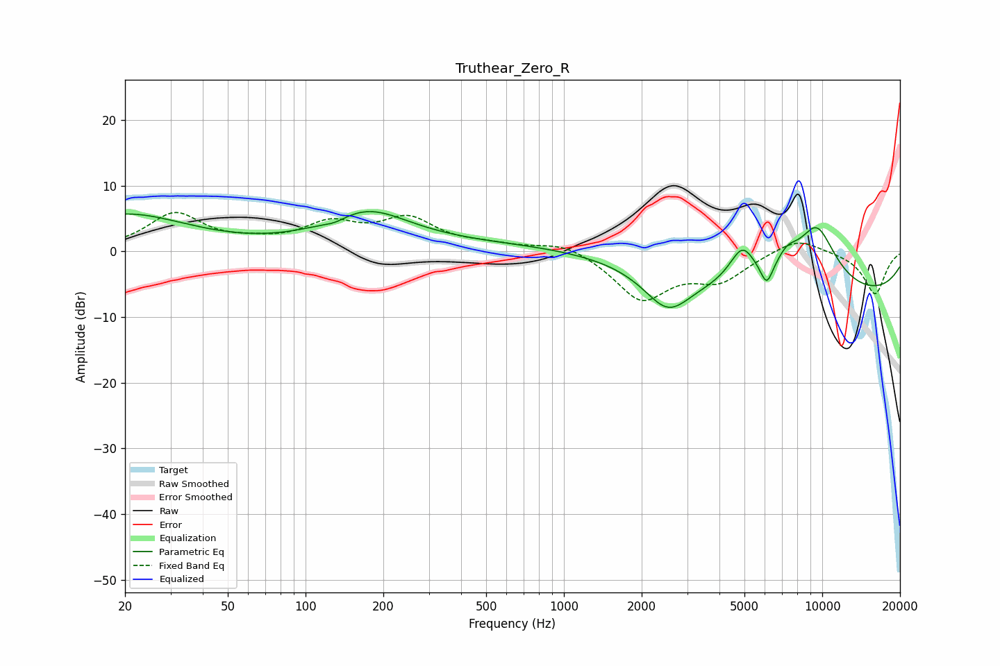

# Truthear_Zero_R
See [usage instructions](https://github.com/jaakkopasanen/AutoEq#usage) for more options and info.

### Parametric EQs
Apply preamp of -6.1 dB when using parametric equalizer.

|   # | Type    |   Fc (Hz) |    Q |   Gain (dB) |
|-----|---------|-----------|------|-------------|
|   1 | Peaking |        20 | 0.58 |         5.6 |
|   2 | Peaking |       130 | 3.03 |        -0.7 |
|   3 | Peaking |       173 | 0.87 |         5.3 |
|   4 | Peaking |       856 | 0.18 |         1.3 |
|   5 | Peaking |      2524 | 1.54 |        -6.1 |
|   6 | Peaking |      4909 | 2.74 |         5.5 |
|   7 | Peaking |      6097 | 5.87 |        -3.3 |
|   8 | Peaking |      7315 | 2.97 |         2.6 |
|   9 | Peaking |      9504 | 1.48 |        10.1 |
|  10 | Peaking |     10000 | 0.19 |        -7.3 |

### Fixed Band EQs
When using fixed band (also called graphic) equalizer, apply preamp of **-6.0 dB** (if available) and set gains manually with these parameters.

|   # | Type    |   Fc (Hz) |    Q |   Gain (dB) |
|-----|---------|-----------|------|-------------|
|   1 | Peaking |        31 | 1.41 |         5.6 |
|   2 | Peaking |        62 | 1.41 |         0.8 |
|   3 | Peaking |       125 | 1.41 |         3.7 |
|   4 | Peaking |       250 | 1.41 |         4.6 |
|   5 | Peaking |       500 | 1.41 |         0.7 |
|   6 | Peaking |      1000 | 1.41 |         1.6 |
|   7 | Peaking |      2000 | 1.41 |        -7.2 |
|   8 | Peaking |      4000 | 1.41 |        -4   |
|   9 | Peaking |      8000 | 1.41 |         2.4 |
|  10 | Peaking |     16000 | 1.41 |        -6.5 |

### Graphs

