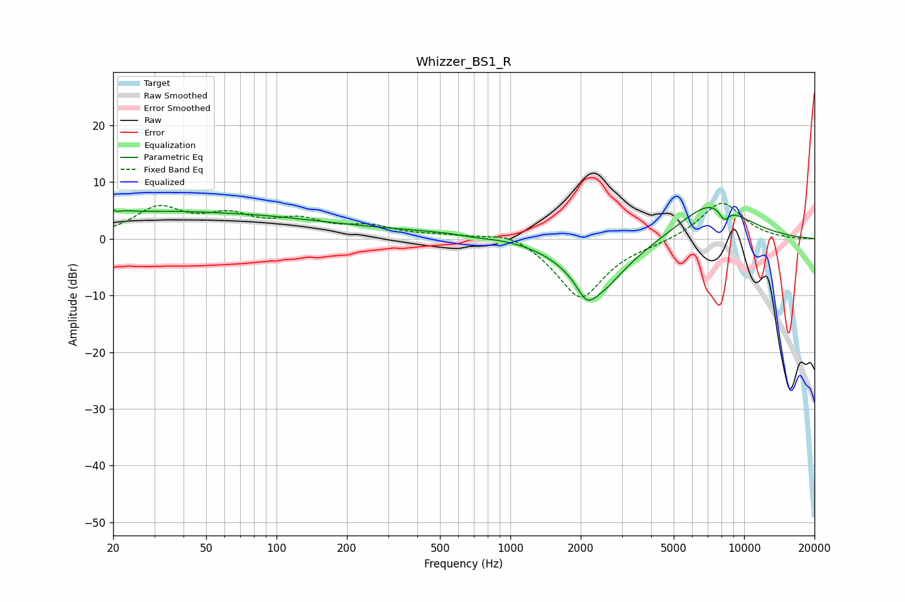

# Whizzer_BS1_R
See [usage instructions](https://github.com/jaakkopasanen/AutoEq#usage) for more options and info.

### Parametric EQs
Apply preamp of -5.6 dB when using parametric equalizer.

|   # | Type    |   Fc (Hz) |    Q |   Gain (dB) |
|-----|---------|-----------|------|-------------|
|   1 | Peaking |        20 | 4.13 |         4.5 |
|   2 | Peaking |        20 | 5.18 |        -3.6 |
|   3 | Peaking |        37 | 0.28 |         4.7 |
|   4 | Peaking |        58 | 0.87 |        -0.3 |
|   5 | Peaking |       504 | 0.18 |         1.4 |
|   6 | Peaking |       712 | 2.11 |        -0.4 |
|   7 | Peaking |      2114 | 3.79 |        -2.8 |
|   8 | Peaking |      2360 | 1.08 |       -10.1 |
|   9 | Peaking |      7262 | 0.92 |         6.8 |
|  10 | Peaking |      8214 | 5.99 |        -2.2 |

### Fixed Band EQs
When using fixed band (also called graphic) equalizer, apply preamp of **-6.4 dB** (if available) and set gains manually with these parameters.

|   # | Type    |   Fc (Hz) |    Q |   Gain (dB) |
|-----|---------|-----------|------|-------------|
|   1 | Peaking |        31 | 1.41 |         5.1 |
|   2 | Peaking |        62 | 1.41 |         3.4 |
|   3 | Peaking |       125 | 1.41 |         2.8 |
|   4 | Peaking |       250 | 1.41 |         1.9 |
|   5 | Peaking |       500 | 1.41 |         0.6 |
|   6 | Peaking |      1000 | 1.41 |         1.8 |
|   7 | Peaking |      2000 | 1.41 |       -10.7 |
|   8 | Peaking |      4000 | 1.41 |        -0.5 |
|   9 | Peaking |      8000 | 1.41 |         6.7 |
|  10 | Peaking |     16000 | 1.41 |        -0.1 |

### Graphs

