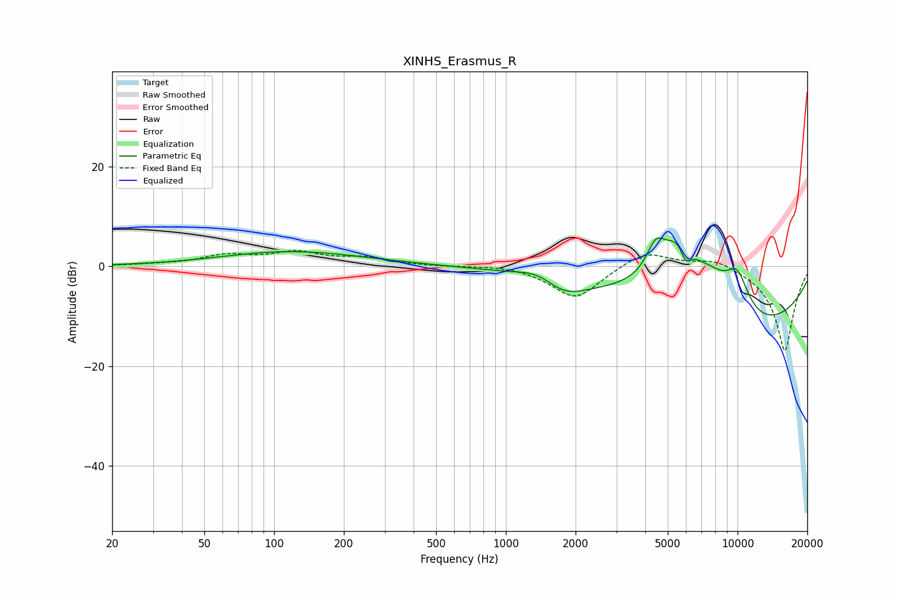

# XINHS_Erasmus_R
See [usage instructions](https://github.com/jaakkopasanen/AutoEq#usage) for more options and info.

### Parametric EQs
Apply preamp of -5.8 dB when using parametric equalizer.

|   # | Type    |   Fc (Hz) |    Q |   Gain (dB) |
|-----|---------|-----------|------|-------------|
|   1 | Peaking |       105 | 0.67 |         0.6 |
|   2 | Peaking |       127 | 0.43 |         2.4 |
|   3 | Peaking |      1392 | 1.59 |         2.3 |
|   4 | Peaking |      1763 | 1.46 |        -3.5 |
|   5 | Peaking |      4434 | 3.5  |         5.4 |
|   6 | Peaking |      5639 | 1.26 |        15.3 |
|   7 | Peaking |      5967 | 5.34 |        -4.3 |
|   8 | Peaking |      7859 | 1.55 |         3.9 |
|   9 | Peaking |      9560 | 0.27 |       -14.5 |
|  10 | Peaking |      9969 | 2.31 |         7.9 |

### Fixed Band EQs
When using fixed band (also called graphic) equalizer, apply preamp of **-3.2 dB** (if available) and set gains manually with these parameters.

|   # | Type    |   Fc (Hz) |    Q |   Gain (dB) |
|-----|---------|-----------|------|-------------|
|   1 | Peaking |        31 | 1.41 |         0.2 |
|   2 | Peaking |        62 | 1.41 |         2   |
|   3 | Peaking |       125 | 1.41 |         2.5 |
|   4 | Peaking |       250 | 1.41 |         1.5 |
|   5 | Peaking |       500 | 1.41 |        -0.1 |
|   6 | Peaking |      1000 | 1.41 |         0.4 |
|   7 | Peaking |      2000 | 1.41 |        -6.6 |
|   8 | Peaking |      4000 | 1.41 |         3.4 |
|   9 | Peaking |      8000 | 1.41 |         1.9 |
|  10 | Peaking |     16000 | 1.41 |       -17.1 |

### Graphs

