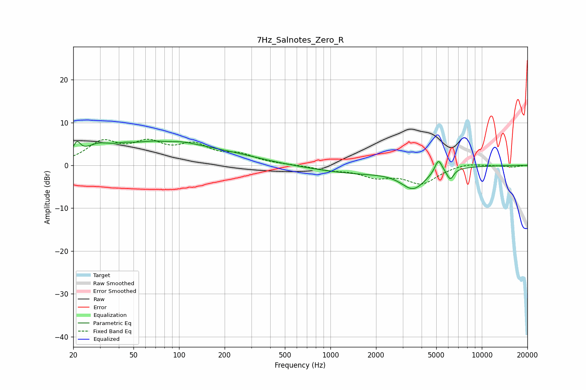

# 7Hz_Salnotes_Zero_R
See [usage instructions](https://github.com/jaakkopasanen/AutoEq#usage) for more options and info.

### Parametric EQs
Apply preamp of -5.8 dB when using parametric equalizer.

|   # | Type    |   Fc (Hz) |    Q |   Gain (dB) |
|-----|---------|-----------|------|-------------|
|   1 | Peaking |        21 | 5.99 |         3   |
|   2 | Peaking |        29 | 1.57 |         3   |
|   3 | Peaking |        43 | 2.31 |         0.8 |
|   4 | Peaking |        79 | 0.62 |         5.5 |
|   5 | Peaking |        82 | 1.96 |        -0.8 |
|   6 | Peaking |       218 | 0.62 |         1.6 |
|   7 | Peaking |      1461 | 0.51 |        -1.7 |
|   8 | Peaking |      3530 | 1.72 |        -4.7 |
|   9 | Peaking |      5166 | 5.8  |         3.2 |
|  10 | Peaking |      6188 | 6    |        -2.5 |

### Fixed Band EQs
When using fixed band (also called graphic) equalizer, apply preamp of **-6.2 dB** (if available) and set gains manually with these parameters.

|   # | Type    |   Fc (Hz) |    Q |   Gain (dB) |
|-----|---------|-----------|------|-------------|
|   1 | Peaking |        31 | 1.41 |         5   |
|   2 | Peaking |        62 | 1.41 |         4.3 |
|   3 | Peaking |       125 | 1.41 |         4.1 |
|   4 | Peaking |       250 | 1.41 |         2.1 |
|   5 | Peaking |       500 | 1.41 |         0.1 |
|   6 | Peaking |      1000 | 1.41 |        -0.9 |
|   7 | Peaking |      2000 | 1.41 |        -2.4 |
|   8 | Peaking |      4000 | 1.41 |        -4   |
|   9 | Peaking |      8000 | 1.41 |         0.7 |
|  10 | Peaking |     16000 | 1.41 |        -0.4 |

### Graphs

