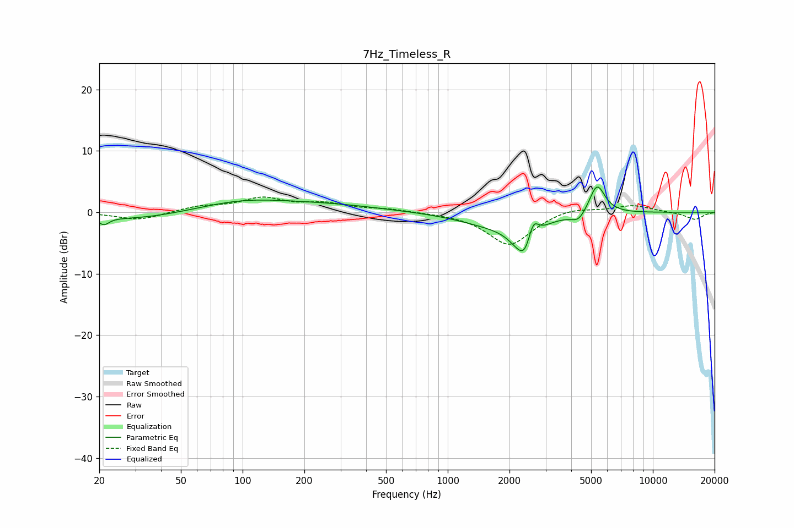

# 7Hz_Timeless_R
See [usage instructions](https://github.com/jaakkopasanen/AutoEq#usage) for more options and info.

### Parametric EQs
Apply preamp of -4.2 dB when using parametric equalizer.

|   # | Type    |   Fc (Hz) |    Q |   Gain (dB) |
|-----|---------|-----------|------|-------------|
|   1 | Peaking |        21 | 5.7  |        -1.2 |
|   2 | Peaking |        31 | 0.55 |        -1.3 |
|   3 | Peaking |       100 | 0.6  |         1.9 |
|   4 | Peaking |       277 | 0.56 |         0.9 |
|   5 | Peaking |      1625 | 0.84 |        -1.8 |
|   6 | Peaking |      2338 | 2.37 |        -5.3 |
|   7 | Peaking |      2375 | 6    |        -0.9 |
|   8 | Peaking |      2613 | 5.78 |         3.3 |
|   9 | Peaking |      4355 | 3.81 |        -1.6 |
|  10 | Peaking |      5343 | 3.6  |         4.9 |

### Fixed Band EQs
When using fixed band (also called graphic) equalizer, apply preamp of **-2.6 dB** (if available) and set gains manually with these parameters.

|   # | Type    |   Fc (Hz) |    Q |   Gain (dB) |
|-----|---------|-----------|------|-------------|
|   1 | Peaking |        31 | 1.41 |        -1.3 |
|   2 | Peaking |        62 | 1.41 |         0.9 |
|   3 | Peaking |       125 | 1.41 |         2.1 |
|   4 | Peaking |       250 | 1.41 |         1.2 |
|   5 | Peaking |       500 | 1.41 |         0.5 |
|   6 | Peaking |      1000 | 1.41 |        -0.1 |
|   7 | Peaking |      2000 | 1.41 |        -5.4 |
|   8 | Peaking |      4000 | 1.41 |         0.9 |
|   9 | Peaking |      8000 | 1.41 |         1.1 |
|  10 | Peaking |     16000 | 1.41 |        -1.2 |

### Graphs

