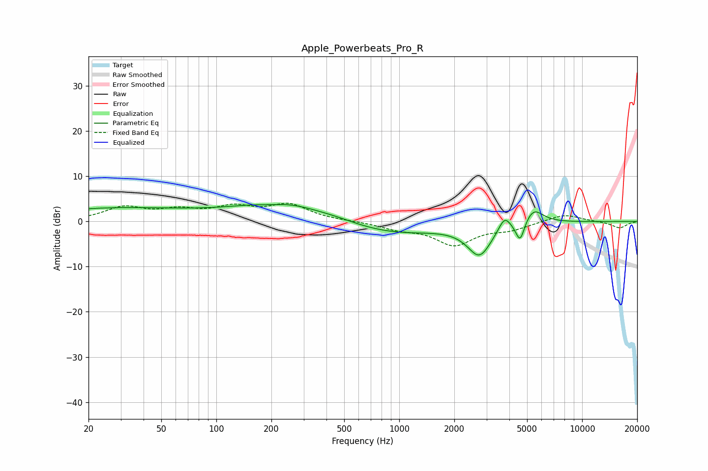

# Apple_Powerbeats_Pro_R
See [usage instructions](https://github.com/jaakkopasanen/AutoEq#usage) for more options and info.

### Parametric EQs
Apply preamp of -3.9 dB when using parametric equalizer.

|   # | Type    |   Fc (Hz) |    Q |   Gain (dB) |
|-----|---------|-----------|------|-------------|
|   1 | Peaking |        20 | 0.4  |         1.4 |
|   2 | Peaking |        51 | 0.28 |         1.8 |
|   3 | Peaking |       196 | 2    |        -0.5 |
|   4 | Peaking |       234 | 0.66 |         3.7 |
|   5 | Peaking |       454 | 1.14 |         0.6 |
|   6 | Peaking |       916 | 0.52 |        -2.8 |
|   7 | Peaking |      2747 | 2.12 |        -7   |
|   8 | Peaking |      3765 | 4.35 |         3.1 |
|   9 | Peaking |      4582 | 5.75 |        -4.8 |
|  10 | Peaking |      5401 | 2.63 |         3.5 |

### Fixed Band EQs
When using fixed band (also called graphic) equalizer, apply preamp of **-4.1 dB** (if available) and set gains manually with these parameters.

|   # | Type    |   Fc (Hz) |    Q |   Gain (dB) |
|-----|---------|-----------|------|-------------|
|   1 | Peaking |        31 | 1.41 |         3   |
|   2 | Peaking |        62 | 1.41 |         2.1 |
|   3 | Peaking |       125 | 1.41 |         2.8 |
|   4 | Peaking |       250 | 1.41 |         3.5 |
|   5 | Peaking |       500 | 1.41 |         0.1 |
|   6 | Peaking |      1000 | 1.41 |        -1.4 |
|   7 | Peaking |      2000 | 1.41 |        -5   |
|   8 | Peaking |      4000 | 1.41 |        -1.5 |
|   9 | Peaking |      8000 | 1.41 |         1.7 |
|  10 | Peaking |     16000 | 1.41 |        -1.4 |

### Graphs

