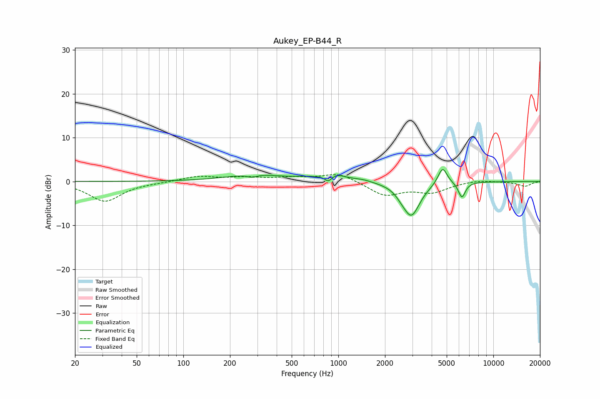

# Aukey_EP-B44_R
See [usage instructions](https://github.com/jaakkopasanen/AutoEq#usage) for more options and info.

### Parametric EQs
Apply preamp of -2.8 dB when using parametric equalizer.

|   # | Type    |   Fc (Hz) |    Q |   Gain (dB) |
|-----|---------|-----------|------|-------------|
|   1 | Peaking |       277 | 4.19 |        -0.7 |
|   2 | Peaking |       287 | 0.82 |         1.6 |
|   3 | Peaking |       622 | 1.9  |         0.4 |
|   4 | Peaking |       863 | 6    |        -1.5 |
|   5 | Peaking |       948 | 2.06 |         1.5 |
|   6 | Peaking |      1431 | 2.42 |         0.5 |
|   7 | Peaking |      2554 | 4.1  |        -0.7 |
|   8 | Peaking |      2957 | 2.53 |        -7.6 |
|   9 | Peaking |      4704 | 4.68 |         4   |
|  10 | Peaking |      6267 | 6    |        -3.5 |

### Fixed Band EQs
When using fixed band (also called graphic) equalizer, apply preamp of **-1.6 dB** (if available) and set gains manually with these parameters.

|   # | Type    |   Fc (Hz) |    Q |   Gain (dB) |
|-----|---------|-----------|------|-------------|
|   1 | Peaking |        31 | 1.41 |        -4.5 |
|   2 | Peaking |        62 | 1.41 |        -0.1 |
|   3 | Peaking |       125 | 1.41 |         1.2 |
|   4 | Peaking |       250 | 1.41 |         0.8 |
|   5 | Peaking |       500 | 1.41 |         0.7 |
|   6 | Peaking |      1000 | 1.41 |         1.9 |
|   7 | Peaking |      2000 | 1.41 |        -3.1 |
|   8 | Peaking |      4000 | 1.41 |        -2.3 |
|   9 | Peaking |      8000 | 1.41 |         0.4 |
|  10 | Peaking |     16000 | 1.41 |        -1.1 |

### Graphs

