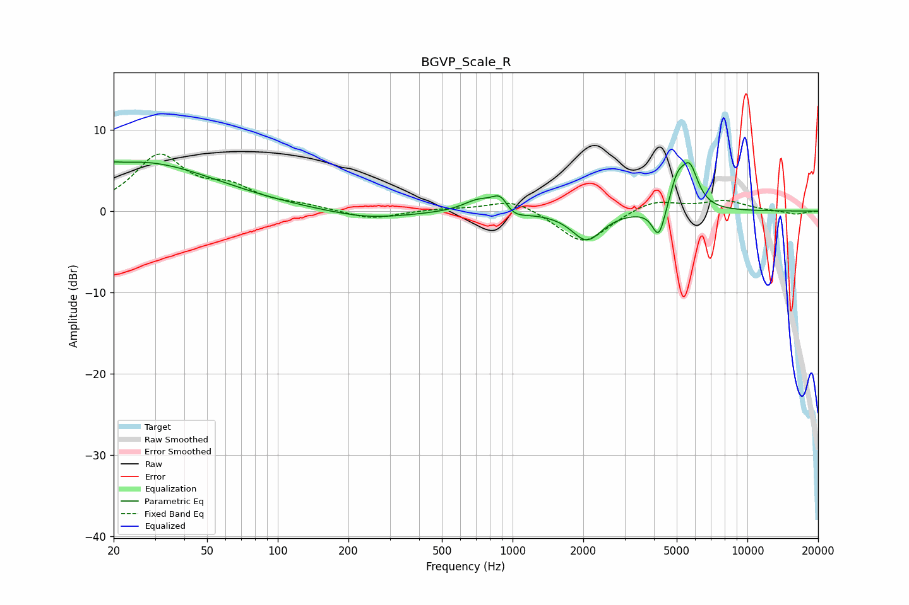

# BGVP_Scale_R
See [usage instructions](https://github.com/jaakkopasanen/AutoEq#usage) for more options and info.

### Parametric EQs
Apply preamp of -6.1 dB when using parametric equalizer.

|   # | Type    |   Fc (Hz) |    Q |   Gain (dB) |
|-----|---------|-----------|------|-------------|
|   1 | Peaking |        20 | 5.96 |         0.3 |
|   2 | Peaking |        26 | 0.43 |         6   |
|   3 | Peaking |       244 | 0.8  |        -1   |
|   4 | Peaking |       718 | 2.15 |         1.5 |
|   5 | Peaking |       894 | 3.7  |         2.8 |
|   6 | Peaking |       958 | 2.62 |        -1.9 |
|   7 | Peaking |      2070 | 2.2  |        -3.6 |
|   8 | Peaking |      4196 | 5.15 |        -3.8 |
|   9 | Peaking |      5010 | 4.46 |         3.1 |
|  10 | Peaking |      5671 | 3.76 |         5   |

### Fixed Band EQs
When using fixed band (also called graphic) equalizer, apply preamp of **-7.1 dB** (if available) and set gains manually with these parameters.

|   # | Type    |   Fc (Hz) |    Q |   Gain (dB) |
|-----|---------|-----------|------|-------------|
|   1 | Peaking |        31 | 1.41 |         6.6 |
|   2 | Peaking |        62 | 1.41 |         2.4 |
|   3 | Peaking |       125 | 1.41 |         0.5 |
|   4 | Peaking |       250 | 1.41 |        -1.1 |
|   5 | Peaking |       500 | 1.41 |         0.2 |
|   6 | Peaking |      1000 | 1.41 |         1.6 |
|   7 | Peaking |      2000 | 1.41 |        -4.1 |
|   8 | Peaking |      4000 | 1.41 |         1.5 |
|   9 | Peaking |      8000 | 1.41 |         1.2 |
|  10 | Peaking |     16000 | 1.41 |        -0.4 |

### Graphs

